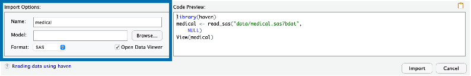
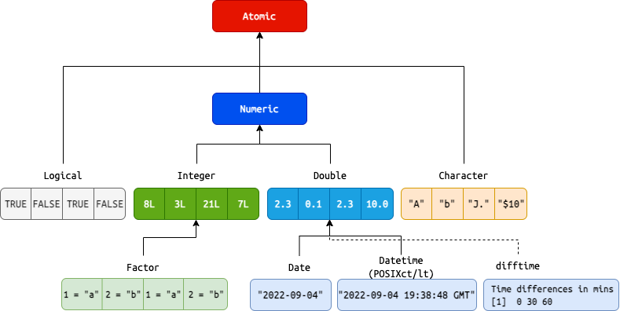
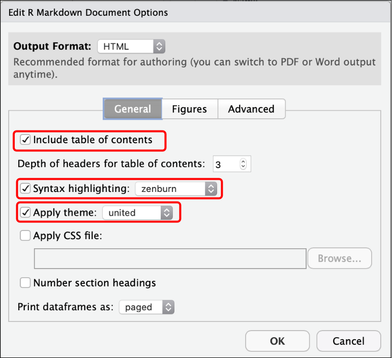

```{r meta, echo=FALSE}
library(metathis)
meta() %>%
  meta_general(
    description = "Introduction to R Markdown",
    generator = "xaringan and remark.js"
  ) %>%
  meta_name("github-repo" = "mjfrigaard/pdg-r/") %>%
  meta_social(
    title = "Data Management with R Markdown",
    url = "https://github.com/mjfrigaard/ph-lacounty-r/",
    og_type = "website",
    og_author = "Martin Frigaard",
    twitter_card_type = "summary",
    twitter_creator = "@mjfrigaard"
  )
```

```{r setup, include=FALSE}
dateWritten <- format(as.Date('2022-10-03'), format = "%B %d %Y")
today <- format(Sys.Date(), format = "%B %d %Y")
library(knitr)
library(tidyverse)
library(fontawesome)
library(gtsummary)
options(
    htmltools.dir.version = FALSE,
    knitr.table.format = "html",
    knitr.kable.NA = ''
)
knitr::opts_chunk$set(
    warning = FALSE,
    message = FALSE,
    fig.path = "www/",
    fig.width = 7.252,
    fig.height = 4,
    comment = " ",
    fig.retina = 3 # Better figure resolution
)
# Enables the ability to show all slides in a tile overview by pressing "o"
xaringanExtra::use_tile_view()
xaringanExtra::use_panelset()
xaringanExtra::use_clipboard()
xaringanExtra::use_share_again()
xaringanExtra::style_share_again(share_buttons = "all")
xaringanExtra::use_extra_styles(
  hover_code_line = TRUE,
  mute_unhighlighted_code = FALSE
)
```

layout: true

<!-- this adds the link footer to all slides, depends on footer-small class in css-->

<div class="footer-small"><span>https://github.com/mjfrigaard/ph-lacounty-r/</div>

---
name: title-slide
class: title-slide, center, middle, inverse

# `r rmarkdown::metadata$title`
#.fancy[`r rmarkdown::metadata$subtitle`]

<br>

.large[by Martin Frigaard]

Written: `r dateWritten`

Updated: `r today`

.footer-large[.right[.fira[
<br><br><br><br><br>[Created using the "λέξις" theme](https://jhelvy.github.io/lexis/index.html#what-does-%CE%BB%CE%AD%CE%BE%CE%B9%CF%82-mean)
]]]


---
background-image: url(www/pdg-hex.png)
background-position: 96% 4%
background-size: 6%

# Materials 

The slides are in the `slides.pdf` file

--

The materials for this training are in the `worksheets` folder: 

```
worksheets
├── import.Rmd
├── export.Rmd
├── objects.Rmd
├── rmd-basic.Rmd
├── rmd-tables.Rmd
└── rmd-visualizations.Rmd
```


---
background-image: url(www/pdg-hex.png)
background-position: 96% 4%
background-size: 6%

# Outline 

<br>

.leftcol[

#### 1. Importing data 

#### 2. Common Data Objects 

#### 3. R Markdown 

]

--

.rightcol[

#### 4. R Markdown Data Visualizations

#### 5. R Markdown Tables

#### 6. Exporting Data 


]

---
background-image: url(www/pdg-hex.png)
class: center, middle, inverse
background-position: 96% 4%
background-size: 6%

# .large[Import Data] 

--

<br><br>

.font90[.green[Open `import.Rmd` to follow along]]

---
background-image: url(www/pdg-hex.png)
class: left, top
background-position: 96% 4%
background-size: 6%

# Importing Data 

#### Packages for importing data:


| File type                           | Package               |
|-------------------------------------|-----------------------|
| SAS (`.sas7bdat`)                   | `haven`               |
| Excel (`.xlsx`, `.xls`)             | `readxl`, `openxlsx`  |
| Plain Text (`.csv`, `.tsv`, `.txt`) | `readr`, `data.table` |


---
background-image: url(www/pdg-hex.png)
class: left, top
background-position: 96% 4%
background-size: 6%

# Importing Data (*Environment*)

#### The .blue[Environment] Pane

```{r rstudio-env.png, echo=FALSE, out.height='100%', out.width='100%'}

```

---
background-image: url(www/pdg-hex.png)
class: left, top
background-position: 96% 4%
background-size: 6%

# Importing Data (*Import Dataset*)

.leftcol[

#### Click .blue[Import Dataset]

#### Click .blue[From SAS]

]

.rightcol[

```{r rstudio-import-dataset, fig.align='left', echo=FALSE, out.height='100%', out.width='100%'}
knitr::include_graphics("www/rstudio-import-dataset.png")
```

]

---
background-image: url(www/pdg-hex.png)
class: left, top
background-position: 96% 4%
background-size: 6%

# Importing Data (*Required Packages*)

#### If you see a prompt to install required packages, click .blue[Yes]

```{r rstudio-dep-pkgs, fig.align='center', echo=FALSE, out.height='60%', out.width='60%'}

```

---
background-image: url(www/pdg-hex.png)
class: left, top
background-position: 96% 4%
background-size: 6%

# Importing Data (*Dialogue Box*)

.leftcol20[

.font80[**You will see the .blue[Import Statistical Data] Dialogue Box**]

.font80[**Click .blue[Browse] and navigate to the `data/medical.sas7bdat` file**]

]

.rightcol80[

```{r rstudio-import-dialogue-01, fig.align='right', echo=FALSE, out.height='80%', out.width='80%'}
knitr::include_graphics("www/rstudio-import-dialogue-01.png")
```

]

---
background-image: url(www/pdg-hex.png)
class: left, top
background-position: 96% 4%
background-size: 6%

# Importing Data (*Dialogue Box*)

.leftcol20[

.font80[**You will see the path in .blue[File/URL]**]

.font80[**A preview of the data will appear in .blue[Data Preview] **]

]

.rightcol80[

```{r rstudio-import-dialogue-02, fig.align='right', echo=FALSE, out.height='70%', out.width='70%'}

```

```{r rstudio-import-dialogue-03, fig.align='right', echo=FALSE, out.height='90%', out.width='90%'}

```

]

---
background-image: url(www/pdg-hex.png)
class: left, top
background-position: 96% 4%
background-size: 6%

# Importing Data (*Dialogue Box*)


.font90[**You see we have additional .blue[Import Options]**]

```{r rstudio-import-dialogue-04, fig.align='right', echo=FALSE, out.height='90%', out.width='90%'}

```

--

.font90[**We also see a .blue[Code Preview]. Click on the small copy icon, then click .blue[Import]**]

```{r rstudio-import-dialogue-05, fig.align='right', echo=FALSE, out.height='90%', out.width='90%'}
knitr::include_graphics("www/rstudio-import-dialogue-05.png")
```


---
background-image: url(www/pdg-hex.png)
class: left, top
background-position: 96% 4%
background-size: 6%

# Importing Data (*Data Viewer*)

.font90[**RStudio imports the data and opens it in the .blue[Data Viewer]**]

```{r rstudio-import-dialogue-06, fig.align='right', echo=FALSE, out.height='100%', out.width='100%'}

```

---
background-image: url(www/pdg-hex.png)
class: left, top
background-position: 96% 4%
background-size: 6%

# Importing Data (*Data Viewer*)

.font90[**We can also see `medical` has been added to our .blue[Environment] pane**]

```{r rstudio-import-dialogue-07, fig.align='right', echo=FALSE, out.height='95%', out.width='95%'}
knitr::include_graphics("www/rstudio-import-dialogue-07.png")
```

---
background-image: url(www/pdg-hex.png)
class: left, top
background-position: 96% 4%
background-size: 6%

# Importing Data 

--

<br>

### .font120[Is what we did reproducible?]

--

<br>

.font120[***.red[No, but it can be!]***]

--

<br>

.font120[Open `import.Rmd` from the `worksheets` folder]

---
background-image: url(www/pdg-hex.png)
class: left, top
background-position: 96% 4%
background-size: 6%

# Importing Data 


.leftcol20[

In `Import.Rmd` 

- Instructions inside `#` boxes won't run

- Fill in `author` and `date` (inside quotes)

]

.rightcol80[

```{r import-instructions, fig.align='right', echo=FALSE, out.height='75%', out.width='75%'}

```

]

---
background-image: url(www/pdg-hex.png)
class: left, top
background-position: 96% 4%
background-size: 6%

# Importing Data (from local)

We already have the code to import `medical.sas7bdat` from local

```{r rstudio-import-dialogue-05-02, fig.align='right', echo=FALSE, out.height='90%', out.width='90%'}
knitr::include_graphics("www/rstudio-import-dialogue-05.png")
```

--

We need to adjust the file path to `../data/medical.sas7bdat`

.leftcol[

.code70[

```
. # importing with dialogue
└── data/
      └── medical.sas7bdat
```

]
]

.rightcol[

.code70[

```
. # importing from file
├── data/
│   └──  medical.sas7bdat
└── worksheets/
    └──  import.Rmd
```

]
]

---
background-image: url(www/pdg-hex.png)
class: left, top
background-position: 96% 4%
background-size: 6%

# Importing Data (download and import)

<br>

We can also download the file from a `url`

.code70[

```{r download.file-url, eval=FALSE}
download.file(
    url = "http://www.principlesofeconometrics.com/sas/medical.sas7bdat", #<<
    )
```

]

--

And save this to a local `destfile`

.code70[

```{r download.file-deestfile, eval=FALSE}
download.file(
    url = "http://www.principlesofeconometrics.com/sas/medical.sas7bdat", 
    destfile = "../data/downloads/medical.sas7bdat") #<<
```

]

---
background-image: url(www/pdg-hex.png)
class: left, top
background-position: 96% 4%
background-size: 6%

# Importing Data (download and import)

<br>

.font120[Now we can import the file from our `downloads/` folder]

.leftcol35[

.code60[

```
. # importing from downloads folder
├── data/
│   ├── medical.sas7bdat
│   └── downloads/
│            └── medical.sas7bdat
└── worksheets/
    └── import.Rmd
```

]

]


.rightcol65[

<br>

.code70[

```{r import-from-destfile, eval=FALSE}
medical <- read_sas("../data/downloads/medical.sas7bdat") 
```

]


]

---
background-image: url(www/pdg-hex.png)
class: left, top
background-position: 96% 4%
background-size: 6%

# Importing Data (parameters)

.font90[For a more permanent solution, we can use parameters in our R Markdown file to store file location (or other metadata)]

.code70[

```yaml
title: "May Report"
author: "Joe Smith"
date: "2022-11-30"
output: html_document

params:
  sas_data_url: !r file.path("http://www.principlesofeconometrics.com/sas/medical.sas7bdat")
  sas_data_dir: !r c("../data/sas/")
```

]

--

.code70[
```{r params-example-01, eval=FALSE}
download.file(url = params$sas_data_url, #<<
    )
```
]

--

.code70[

```{r params-example-02, eval=FALSE}
download.file(url = params$sas_data_url, 
    destfile = params$sas_data_dir) #<<
```

]

---
background-image: url(www/pdg-hex.png)
class: left, top
background-position: 96% 4%
background-size: 6%

# Importing Data (multiple files)

If we have a folder with multiple files, we can reduce duplicated code with iteration. 

--

.leftcol[
.code80[

```
. # importing multiple files
├── data/sas/
│   ├── elemapi-2000.sas7bdat
│   ├── elemapi2-2000.sas7bdat
│   ├── hsb2.sas7bdat
│   └── nations.sas7bdat
└── worksheets/
    └── import.Rmd
```

]
]

--

.rightcol[

.code80[

```{r import-map, eval=FALSE}
# create vector of files
sas_filenames <- list.files(
            path = "../data/sas", 
            full.names = TRUE)
all_sas_data <- sas_filenames |> 
    # give this vector names
    purrr::set_names() |> 
    # use read_sas() on all files
    purrr::map(.x = , .f = read_sas)
```

]

.font90[`all_sas_data` is a list of datasets]

]

---
background-image: url(www/pdg-hex.png)
class: left, top
background-position: 96% 4%
background-size: 6%

# Importing Data (multiple files)


.font90[Each named according to their path in `data/sas/`]

.code55[

```{r , eval=FALSE}
str(all_sas_data)
# $ ../data/sas/elemapi-2000.sas7bdat : tibble [400 × 21] (S3: tbl_df/tbl/data.frame) #<<
#   ..$ snum    : num [1:400] 906 889 887 876 888 ...
#   .. ..- attr(*, "label")= chr "school number"
#   ..$ dnum    : num [1:400] 41 41 41 41 41 98 98 108 108 108 ...
#   .. ..- attr(*, "label")= chr "district number"
#   .. [list output truncated]
#  $ ../data/sas/elemapi2-2000.sas7bdat: tibble [400 × 22] (S3: tbl_df/tbl/data.frame) #<<
#   ..$ snum    : num [1:400] 906 889 887 876 888 ...
#   .. ..- attr(*, "label")= chr "school number"
#   ..$ dnum    : num [1:400] 41 41 41 41 41 98 98 108 108 108 ...
#   .. ..- attr(*, "label")= chr "district number"
#   .. [list output truncated]
#  $ ../data/sas/hsb2.sas7bdat         : tibble [200 × 11] (S3: tbl_df/tbl/data.frame) #<<
#   ..$ id     : num [1:200] 3 5 16 35 8 19 6 1 4 22 ...
#   ..$ female : num [1:200] 0 0 0 1 1 1 1 1 1 0 ...
#   .. [list output truncated]
#  $ ../data/sas/nations.sas7bdat      : tibble [109 × 15] (S3: tbl_df/tbl/data.frame) #<<
#   ..$ country : chr [1:109] "Algeria" "Argentin" "Australi" "Austria" ...
#   .. ..- attr(*, "label")= chr "Country"
#   ..$ pop     : num [1:109] 21.9 30.5 15.8 7.6 100.6 ...
#   .. ..- attr(*, "label")= chr "1985 population in millions"
#   .. [list output truncated]
```

]


---
background-image: url(www/pdg-hex.png)
class: center, middle, inverse
background-position: 96% 4%
background-size: 6%

# .large[Common Data Objects]

--

<br><br>

.font90[.green[Open `objects.Rmd` to follow along]]

---
background-image: url(www/pdg-hex.png)
class: left, top
background-position: 96% 4%
background-size: 6%

# Data Objects: vector

#### Vectors are the fundamental data object in R


```{r atomic-vectors, fig.align='center', echo=FALSE, out.height='85%', out.width='85%'}
knitr::include_graphics("www/atomic-vectors.png")
```

---
background-image: url(www/pdg-hex.png)
class: left, top
background-position: 96% 4%
background-size: 6%

# Data Objects: creating vectors 

<br>

`c()` is used to combine (or concatenate) a variety of elements  

--

`<-` is referred to as the assignment operator, and it’s used with `c()` to assign elements to a designated object

--

*Earlier we used `<-` to create the `medical` dataset*

.leftcol[

Create logical and integer vectors (`log_vec` and `int_vec`)

```{r}
log_vec <- c(TRUE, FALSE)
int_vec <- c(4L, 7L)
```


]

.rightcol[

Create double and character vectors (`dbl_vec` and `chr_vec`)

```{r}
dbl_vec <- c(2.2, 8.09)
chr_vec <- c("A", "D")
```


]

---
background-image: url(www/pdg-hex.png)
class: left, top
background-position: 96% 4%
background-size: 6%

# Data Objects: atomic vectors

.cols3[

.font80[Print Atomic Vectors]

.code60[

```{r}
log_vec
int_vec
dbl_vec
chr_vec
```


]

]

--


.cols3[

.font80[Check with `typeof()`]

.code60[

```{r}
typeof(log_vec)
typeof(int_vec)
typeof(dbl_vec)
typeof(chr_vec)
```

]

]

--

.cols3[

.font80[Check `class()`]

.code60[

```{r}
class(log_vec)
class(int_vec)
class(dbl_vec) #<<
class(chr_vec)
```


]

]

---
background-image: url(www/pdg-hex.png)
class: left, top
background-position: 96% 4%
background-size: 6%

# Data Objects: S3 vectors

```{r s3-vectors, fig.align='center', echo=FALSE, out.height='85%', out.width='85%'}

```


---
background-image: url(www/pdg-hex.png)
class: left, top
background-position: 96% 4%
background-size: 6%

# Data Objects: S3 vectors


.leftcol[

.font80[Create S3 Vectors]

.code60[

```{r}
fct_vec <- factor(
        x = c("Medium", "Low", "High"), 
        levels = c("Low", "Medium", "High"))
date_vec <- c(Sys.Date(), Sys.Date() + 1)
dt_vec <- c(Sys.time(), Sys.time() + (86400*365))
difft_vec <- difftime(
            time1 = Sys.time(), 
            time2 = Sys.time() + (86400*365), 
            units = "days")
```


]

]

.rightcol[

.font80[View S3 vectors]

.code55[

```{r}
fct_vec
date_vec
dt_vec
difft_vec
```

]
]

---
background-image: url(www/pdg-hex.png)
class: left, top
background-position: 96% 4%
background-size: 6%

# Data Objects: S3 vectors

.leftcol[

.font80[Check `typeof()`]

.code60[

```{r}
typeof(fct_vec)
typeof(date_vec)
typeof(dt_vec)
typeof(difft_vec)
```

]
]

.rightcol[

.font80[Check `class()`]

.code60[

```{r}
class(fct_vec)
class(date_vec)
class(dt_vec)
class(difft_vec)
```

]
]

---
background-image: url(www/pdg-hex.png)
class: left, top
background-position: 96% 4%
background-size: 6%

# Data Objects: S3 vectors

.font90[**S3 vectors have additional `attributes()`**]

--

.cols3[

.font80[Factor attributes]

.code60[

```{r}
attributes(fct_vec)
```


]

]

--

.cols3[

.font80[Date/Datetime attributes]

.code60[

```{r}
attributes(date_vec)
attributes(dt_vec)
```

]
]

--

.cols3[

.font80[Difftime attributes]

.code60[

```{r}
attributes(difft_vec)
```

]
]

---
background-image: url(www/pdg-hex.png)
class: left, top
background-position: 96% 4%
background-size: 6%

# Data Objects: lists

.font90[**Vectors have to be the same type, or `class`**]

--

.font90[**Lists can contain objects of different `class`es**]

--

.leftcol40[

```{r}
atomic_list <- list(
    'logical vector' = log_vec,
    'integer vector' = int_vec,
    'double vector' = dbl_vec,
    'character vector' = chr_vec
)
```


]

--

.rightcol60[

```{r}
atomic_list
```


]

---
background-image: url(www/pdg-hex.png)
class: left, top
background-position: 96% 4%
background-size: 6%

# Data Objects: lists

.font90[**Lists can even contain other lists!**]

--

.leftcol[

.font80[Create list of date vectors]

.code60[
```{r}
s3_list <- list(
    'date vector' = date_vec,
    'datetime vector' = dt_vec,
    'difftime vector' = difft_vec
)
```
]

.font80[Create list of lists]

.code60[
```{r}
vector_list <- list(
    'S3 list' = s3_list,
    'Atomic list' = atomic_list
)
```
]

]

--

.rightcol[

.code50[

```{r}
vector_list
```

]
]

---
background-image: url(www/pdg-hex.png)
class: left, top
background-position: 96% 4%
background-size: 6%

# Data Objects: data.frames

.font120[**A `data.frame` is a rectangular list**]

.leftcol30[

.font80[Create `data.frame`]

.code60[

```{r}
my_df <- data.frame(
    log_col = log_vec,
    int_col = int_vec,
    dbl_col = dbl_vec,
    chr_col = chr_vec,
    date_col = date_vec,
    dt_col = dt_vec
)
```

]

]

--

.rightcol70[

.font80[View `data.frame`]

.code60[

```{r}
my_df
```

]

]

---
background-image: url(www/pdg-hex.png)
class: left, top
background-position: 96% 4%
background-size: 6%

# Data Objects: data.frames

.font90[**Check the structure of the `data.frame`**]

.code60[

```{r}
str(my_df)
```

]

--

.font90[**Check the `class` and `typeof()` for the a `data.frame`**]

.leftcol[

.code60[
```{r}
class(my_df)
```
]

]

--

.rightcol[

.code60[

```{r}
typeof(my_df)
```

]

]

---
background-image: url(www/pdg-hex.png)
class: left, top
background-position: 96% 4%
background-size: 6%

# Data Objects: tibbles

.font90[**A tibble is a [modern reimagining](https://tibble.tidyverse.org/) of the `data.frame`**]

--

.font90[They are created just like `data.frame`s]

--

.leftcol30[

.font80[Create `tibble`]

.code60[

```{r}
my_tbl <- tibble(
    log_col = log_vec,
    int_col = int_vec,
    dbl_col = dbl_vec,
    chr_col = chr_vec,
    date_col = date_vec,
    dt_col = dt_vec
)
```

]

]

--

.rightcol70[

.font80[View `tibble`]

.code60[

```{r}
my_tbl
```

]

]


---
background-image: url(www/pdg-hex.png)
class: left, top
background-position: 96% 4%
background-size: 6%

# Data Objects: data.frames & tibbles

.font90[`tibble`s print a little nicer than `data.frame`s, and we'll primarily be using them because they work well with other functions for tables and visualizations.]

--

.code80[

```{r}
my_df
```

]

--

.code80[

```{r}
my_tbl
```

]


---
background-image: url(www/pdg-hex.png)
class: center, middle, inverse
background-position: 96% 4%
background-size: 6%

# .large[R Markdown]

--

<br><br>

.font90[.green[Open `rmd-basics.Rmd` to follow along]]

---
background-image: url(www/pdg-hex.png)
background-position: 96% 4%
background-size: 6%

```{r rmarkdown_wizards, echo=FALSE, out.width="70%", out.height="70%"}
# copy_slide_images("rmarkdown_wizards.png")
knitr::include_graphics("www/rmarkdown_wizards.png")
```

.footer-large[.right[Artwork by @allison_horst]]

---
class: left, top
background-image: url(www/pdg-hex.png)
background-position: 96% 4%
background-size: 6%

# How R Markdown Works

#### R Markdown combines .red[metadata], prose, *and* executable code 

```{r rmd-yaml, echo = FALSE, out.height="90%", out.width="90%", fig.align='center'}

```

---
class: left, top
background-image: url(www/pdg-hex.png)
background-position: 96% 4%
background-size: 6%

# How R Markdown Works

#### R Markdown combines metadata, .red[prose], *and* executable code 

```{r rmd-md, echo = FALSE, out.height="85%", out.width="85%", fig.align='center'}

```


---
class: left, top
background-image: url(www/pdg-hex.png)
background-position: 96% 4%
background-size: 6%

# How R Markdown Works

#### R Markdown combines metadata, prose, *and* .red[executable code] 

```{r rmd-code, echo = FALSE, out.height="75%", out.width="75%", fig.align='center'}
knitr::include_graphics("www/rmd-code.png")
```


---
class: left, top
background-image: url(www/pdg-hex.png)
background-position: 96% 4%
background-size: 6%

# R Markdown: YAML

## `.yaml` = Metadata
### ~~`.md` = Prose~~  
### ~~`.R` = Code~~

--

### YAML is a human friendly data serialization standard for all programming languages.

--

### YAML stands for *'YAML Ain't Markup Language'* (funny, huh?)


---
class: left, top
background-image: url(www/pdg-hex.png)
background-position: 96% 4%
background-size: 6%

# R Markdown: YAML

<br><br>

.leftcol[

### YAML contains the information about the document we're going to create

]

.rightcol[
.code120[

```yml
---
title: "Untitled"
author: "John Doe"
output: html_document
---
```

]
]


---
class: left, top
background-image: url(www/pdg-hex.png)
background-position: 96% 4%
background-size: 6%

# R Markdown: YAML

<br>

```{r yaml-formatting-01, echo = FALSE, out.height="100%", out.width="100%", fig.align='center'}

```

---
class: left, top
background-image: url(www/pdg-hex.png)
background-position: 96% 4%
background-size: 6%

# R Markdown: YAML

<br>

```{r yaml-formatting-02, echo = FALSE, out.height="60%", out.width="60%", fig.align='center'}

```


---
class: left, top
background-image: url(www/pdg-hex.png)
background-position: 96% 4%
background-size: 6%

# R Markdown: YAML

<br>

.leftcol[

#### Table of contents: 

.font90[**`toc:`** binary (**`yes`** or **`no`**)]

.font90[**`toc_float:`** logical (**`true`** or **`false`**)]

.font90[**`toc_depth:`** set numerically **`0`** - **`6`**]


]


.rightcol[

#### _Indentation matters in YAML!!_

> Check out the [YAML Fieldguide](https://cran.r-project.org/web/packages/ymlthis/vignettes/yaml-fieldguide.html) for a comprehensive list

]


---
class: left, top
background-image: url(www/pdg-hex.png)
background-position: 96% 4%
background-size: 6%

# R Markdown: YAML

### Create a floating table of contents

.leftcol60[

.font90[Open the **`rmd-basic.Rmd`** file in the `worksheets` folder] 

.font90[Change the `output` in the YAML header to the following:]

]

--

.rightcol40[
.code70[

```yml
---
title: "R Markdown Basics"
author: ""
date: ""
output: 
  html_document: 
    toc: yes
    toc_float: true
---
```

]
]

--

.font90[***Knit the document again***]


---
class: left, top
background-image: url(www/pdg-hex.png)
background-position: 96% 4%
background-size: 6%

# R Markdown: YAML 

### Floating table of contents (rendered)

```{r yaml-toc-settings, echo = FALSE, out.height="90%", out.width="90%", fig.align='center'}

```

---
class: left, top
background-image: url(www/pdg-hex.png)
background-position: 96% 4%
background-size: 6%

# R Markdown: YAML

### Text highlighting and theme options

.leftcol[

.font90[Add **`highlight`** and **`theme`** to the YAML header]

]

.rightcol[
.code80[

```yml
---
title: "R Markdown Basics"
author: ""
date: ""
output: 
  html_document: 
    toc: yes
    toc_float: yes
    highlight: zenburn 
    theme: united 

---
```

]
]

--

#### *Knit the document again*


---
class: left, top
background-image: url(www/pdg-hex.png)
background-position: 96% 4%
background-size: 6%

# R Markdown: YAML

### Text highlighting and theme options (rendered)

```{r yaml-highlight-theme, echo = FALSE, out.height="90%", out.width="90%", fig.align='center'}

```

---
class: left, top
background-image: url(www/pdg-hex.png)
background-position: 96% 4%
background-size: 6%

# R Markdown: YAML


.leftcol40[

### You can change the YAML contents using the settings (small gear)

]


.rightcol60[

```{r knitr-settings, echo = FALSE, out.height="70%", out.width="70%", fig.align='center'}

```

]

---
class: left, top
background-image: url(www/pdg-hex.png)
background-position: 96% 4%
background-size: 6%

# R Markdown: YAML

.leftcol[

### This window gives us the ability to manually change some of the YAML settings (but not all of them!)

]

--

.rightcol[

```{r edit-rmd-output-options, echo = FALSE, out.height="90%", out.width="90%", fig.align='left'}

```

]

---
class: left, top
background-image: url(www/pdg-hex.png)
background-position: 96% 4%
background-size: 6%

# R Markdown: YAML

.leftcol40[

### .font80[Change the **Output Format** to **PDF**]

### .font70[Adjust the level of header in the table of contents to **4**]

### .font70[Set the syntax highlighting to **espresso**]

]

.rightcol60[

```{r pdf-rmd-output-options, echo = FALSE, out.height="80%", out.width="80%", fig.align='center'}

```
]

--

#### .font80[*Knit the document again*]


---
class: left, top
background-image: url(www/pdg-hex.png)
background-position: 96% 4%
background-size: 6%

# R Markdown: YAML

### .font80[PDF Document Options (rendered)]

.leftcol20[

### .font80[A new window will open with the PDF preview]

]

.rightcol80[

```{r rmd-pdf-rendered-output, echo = FALSE, out.height="85%", out.width="85%", fig.align='center'}

```

]

---
class: left, top
background-image: url(www/pdg-hex.png)
background-position: 96% 4%
background-size: 6%

# R Markdown: YAML

### .font80[Common output formats]

```{r rmd-exports, echo = FALSE, out.height="37%", out.width="37%", fig.align='center'}

```

---
background-image: url(www/pdg-hex.png)
background-position: 96% 4%
background-size: 6%

# R Markdown: YAML

### Output formats

.font80[

| Function                    | Outputs             |
|-----------------------------|---------------------|
| `html_document()`           | HTML document       |
| `pdf_document()`            | PDF document        |
| `word_document()`           | Word document       |
| `odt_document()`            | ODT document        |
| `rtf_document()`            | RTF document        |
| `md_document()`             | Markdown document   |
| `slidy_presentation()`      | Slidy Slides (HTML) |
| `beamer_presentation()`     | Beamer Slides (PDF) |
| `ioslides_presentation()`   | ioslides (HTML)     |
| `powerpoint_presentation()` | PowerPoint (pptx)   |

]


---
class: left, top
background-image: url(www/pdg-hex.png)
background-position: 96% 4%
background-size: 6%


# R Markdown: Markdown

### ~~`.yaml` = Metadata~~
## `.md` = Prose
### ~~`.R` = Code~~


---
class: left, top
background-image: url(www/pdg-hex.png)
background-position: 96% 4%
background-size: 6%

# R Markdown: Markdown

.leftcol[.large[

#### Italics, Bold, and Code

```markdown
For italics, you can use *this* or _this_.

If you want bold, you can use **this** or __this__. 

If you want text formatted as code, you can use `this`.
```

]]

--

.rightcol[.font90[

<br><br><br>

For italics, you can use *this* or _this_.

If you want bold, you can use **this** or __this__. 

If you want text formatted as code, you can use `this`.

]]

---
background-image: url(www/pdg-hex.png)
background-position: 96% 4%
background-size: 6%
class: left, top

# R Markdown: Markdown

.leftcol[.large[

#### Headers

```md
# Header 1
## Header 2
### Header 3
```

]]

--

.rightcol[.large[.center[

# Header 1  
## Header 2  
### Header 3 

]]]

---
background-image: url(www/pdg-hex.png)
background-position: 96% 4%
background-size: 6%
class: left, top

# R Markdown: Markdown

.cols3[

#### Bullets & Numeric Lists

]

.cols3[

<br>

```markdown
  - Item 1  
  - Item 2
      + Item 2a
      + Item 2b
        - Item 2b.1
        - Item 2b.2
    
 1. Item 1
 2. Item 2  
   a. Item 2a  
   b. Item 2b  
```
  
]

.cols3[

<br>

* Item 1  
* Item 2
    + Item 2a
    + Item 2b
      - Item 2b.1
      - Item 2b.2


 1. Item 1
 2. Item 2  
   a. Item 2a  
   b. Item 2b  
 
]


---
background-image: url(www/pdg-hex.png)
background-position: 96% 4%
background-size: 6%
class: left, top

# R Markdown: Markdown


.leftcol55[

#### Hyperlinks 

```md
[linked phrase](https://posit.co/)
```


]


--

.rightcol45[

#### *becomes...*

.center[.large[

[linked phrase](https://posit.co/)

]]]


---
background-image: url(www/pdg-hex.png)
background-position: 96% 4%
background-size: 6%
class: left, top


# R Markdown: Markdown

.leftcol55[

#### Images 

.small[

```md


```

]]

--

.rightcol45[

#### *becomes...*

```{r Rlogo.png, echo = FALSE, out.height="30%", out.width="30%", fig.align='center'}
knitr::include_graphics("https://www.r-project.org/logo/Rlogo.png")
```

]


---
background-image: url(www/pdg-hex.png)
background-position: 96% 4%
background-size: 6%
class: left, top

# R Markdown: Markdown

.leftcol[

#### Math Equations

```md
$equation$

$$ equation $$
```

]

--

<br>

.rightcol[.large[

$equation$

$$ equation $$

]]


---
background-image: url(www/pdg-hex.png)
background-position: 96% 4%
background-size: 6%
class: left, top

# R Markdown: Markdown

.leftcol45[

#### Strike-through

```md
~~strikethrough~~
```

]

--

<br>

.rightcol55[.center[.large[

 ~~strikethrough~~

]]]

---
background-image: url(www/pdg-hex.png)
background-position: 96% 4%
background-size: 6%
class: left, top

# R Markdown: Markdown

.font90[In `rmd-basic.Rmd`, add the following paragraph in the **R Markdown** section, after the first sentence. 

--

> R Markdown is a plain-text file format that combines narrative text (with markdown, a lightweight markup syntax) and executable code chunks (R, Python, or SQL) to produce multiple output formats (.html, .pdf, .docx, .pptx, etc.)

--

.leftcol[
.font80[
- make 'plain-text' *italic*

- insert the wikipedia page link for [markdown](https://en.wikipedia.org/wiki/Markdown): 
`https://en.wikipedia.org/wiki/Markdown`
]
]

.rightcol[
.font80[
- make the code languages **bold**  

- format the file extensions as `code`
]
]


---
background-image: url(www/pdg-hex.png)
background-position: 96% 4%
background-size: 6%

# R Markdown: Code

### ~~`.yaml` = Metadata~~
### ~~`.md` = Prose~~
## `.R` = Code


---
background-image: url(www/pdg-hex.png)
background-position: 96% 4%
background-size: 6%

# R Markdown: Code

### `setup` code chunk

.font90[The first bit of R code in our RMarkdown file is the `setup` chunk]

--

```{r setup-code-chunk, fig.align='center', echo = FALSE, out.height="70%", out.width="70%"}

```

--

.font90[Chunks named '`setup`' are special because they can set global options, and they are run first]

--

.font90['`include=FALSE`' means this code is run, but not displayed]

---
background-image: url(www/pdg-hex.png)
background-position: 96% 4%
background-size: 6%

# R Markdown: Code

### `setup` code chunk contents

```{r setup-code-chunk-02, fig.align='center', echo = FALSE, out.height="70%", out.width="70%"}

```

--

.leftcol30[

.font90[Load packages]

.code70[
```{r , eval=FALSE}
library(tidyverse)
```
]

]

--

.rightcol70[

.font90[Set the URLs for the repositories used by `update.packages`]

.code70[
```{r , eval=FALSE}
options(repos = "https://cloud.r-project.org")
```
]

]

---
background-image: url(www/pdg-hex.png)
background-position: 96% 4%
background-size: 6%

# R Markdown: Code

### `setup` code chunk options

.leftcol60[

.font90[R Markdown code document options come from the `knitr` package]

```{r setup-code-chunk-03, fig.align='left', echo = FALSE, out.height="100%", out.width="100%"}

```

]

--

.rightcol40[

.font90[We can set the chunk and knit options the with syntax below:]

```{r knitr-opts-set, eval = FALSE}
knitr::opts_chunk$set()
knitr::opts_knit$set()
```

]


---
background-image: url(www/pdg-hex.png)
background-position: 96% 4%
background-size: 6%

# R Markdown: Code

### Inserting code chunks


.leftcol[

.font120[Use keyboard shortcuts **CMD/CTRL + I** or **ALT/OPTION + I**]


]

--

.rightcol[

```{r insert-code-chunk, echo = FALSE, out.height="36%", out.width="36%", fig.align='center'}
knitr::include_graphics("www/insert-code-chunk.png")
```

]

---
background-image: url(www/pdg-hex.png)
background-position: 96% 4%
background-size: 6%

# R Markdown: Code

### Code chunks

<br>

.border[

```{r code-chunks, echo = FALSE, out.height="100%", out.width="100%", fig.align='center'}

```

]

---
background-image: url(www/pdg-hex.png)
background-position: 96% 4%
background-size: 6%

# R Markdown: Code

### Code chunk fences

<br>

```{r code-chunk-fences, echo = FALSE, out.height="100%", out.width="100%", fig.align='center'}

```

---
background-image: url(www/pdg-hex.png)
background-position: 96% 4%
background-size: 6%

# R Markdown: Code

### Code chunk names and options

<br>

```{r code-chunk-label-options, echo = FALSE, out.height="100%", out.width="100%", fig.align='center'}

```

---
background-image: url(www/pdg-hex.png)
background-position: 96% 4%
background-size: 6%

# R Markdown: Code

### Code chunk options

.leftcol[

.font80[Common options for code chunks are:]

.font70[

|Option          | Document Effect                              |
|:-------------- |:-------------------------------------------- |
|`include`       | run code, but do/don't print code and results|
|`eval`          | do/don't evaluate the code                   |
|`echo`          | do/don't print code                          |
|`message`       | do/don't print function messages             |
|`warning`       | do/don't print function warnings             |
|`error`         | do/don't knit document with errors           |

]

]

--

.rightcol[

.font80[More advanced options can control language engines (`engine`), caching (`cache`, `dependson`), and plot animations (`fig.show`)]

.font80[See the [knitr web page](https://yihui.name/knitr/options/) for complete list of options]

]


---
background-image: url(www/pdg-hex.png)
background-position: 96% 4%
background-size: 6%

# R Markdown: Code

.leftcol[

.font90[In the `rmd-basic.Rmd` file, delete the **`pressure`** code chunk]

.font90[Insert a new code chunk and name it **`diamonds`**]

.font90[Add the code below]

.code70[

```{r diamonds, eval=FALSE}
ggplot(data = diamonds, 
          aes(x = carat, y = price)) + 
  geom_point(aes(color = cut))
```

.font90[Set **`echo`** to **`FALSE`**]

]

]

--

.rightcol[

.font90[Create another code chunk and name it **`diamonds-show`**]

.font90[Set the options to display this code, but not execute it]

.font90[**Knit the document**]

]

---
background-image: url(www/pdg-hex.png)
background-position: 96% 4%
background-size: 6%

# R Markdown: Code

```{r rmd-chunk-diamonds-show, echo = FALSE, out.height="65%", out.width="65%", fig.align='center'}

```


---
background-image: url(www/pdg-hex.png)
background-position: 96% 4%
background-size: 6%

# R Markdown: Code

### Edit code chunk options

You can also edit code chunk options using the icon (small gear)

```{r code-chunk-settings, echo = FALSE, out.height="40%", out.width="40%", fig.align='center'}

```


---
background-image: url(www/pdg-hex.png)
background-position: 96% 4%
background-size: 6%

# R Markdown: Code

### Code Chunk Engines

More and more code engines all the time 

```{r knit_engines}
names(knitr::knit_engines$get())
```

---
background-image: url(www/pdg-hex.png)
class: center, middle, inverse
background-position: 96% 4%
background-size: 6%

# .large[R Markdown Tables]

--

<br><br>

.font90[.green[Open `rmd-tables.Rmd` to follow along]]

---
background-image: url(www/pdg-hex.png)
background-position: 96% 4%
background-size: 6%


# R Markdown Tables

Import the `nhanes_11_12` data from the `data/csv/` folder.

.code70[
```{r , eval=FALSE}
nhanes_11_12 <- data.table::fread(input = "../data/csv/nhanes_11_12.csv")
glimpse(nhanes_11_12)
```
]

.code60[
```{r nhanes_11_12, echo=FALSE, eval=TRUE}
nhanes_11_12 <- data.table::fread(
    input = "data/csv/nhanes_11_12.csv")
glimpse(nhanes_11_12)
```
]


---
background-image: url(www/pdg-hex.png)
background-position: 96% 4%
background-size: 6%


# R Markdown Tables

Check out the codebook in the `rmd-tables.Rmd` file to get a better understanding of the NHANES variables.  

--

### Calculate Descriptives 

Below we calculate the descriptive statistics with some help from  [`dplyr`](https://dplyr.tidyverse.org/)

--

```{r descriptives}
descriptives <- nhanes_11_12 |> 
    mutate(ht_meters = height*0.01,
           bmi = weight/ht_meters^2) |> 
    group_by(diabetes) |> 
    summarise(n = n(), 
              across(c(age, bmi, bp_sys_ave, tot_chol), 
              mean, na.rm = TRUE))
```


---
background-image: url(www/pdg-hex.png)
background-position: 96% 4%
background-size: 6%

# R Markdown Tables


.leftcol[
If we print `descriptives` to the console, we see a `tibble` output

<br>

.code70[
```{r , eval=FALSE}
descriptives
```
]
.code55[
```{r , eval=TRUE, echo=FALSE}
descriptives
```
]
]


--

.rightcol[
We can use `knitr::kable()` to get a basic formatted table. 

<br>

.font70[
```{r}
knitr::kable(descriptives)
```
]
]


---
background-image: url(www/pdg-hex.png)
background-position: 96% 4%
background-size: 6%

# R Markdown Tables

`knitr::kable()` allows us to adust the contents of the table with arguments like `digits` and `col.names`

.code80[
```{r}
knitr::kable(descriptives, digits = 2, 
    col.names = c("Diabetic", "N", "Age", "BMI", 
        "Sys BP (Avg)", "Total Chol"))
```
]

<br>

Read more about `kable` table options [here](https://bookdown.org/yihui/rmarkdown-cookbook/kable.html) 


---
background-image: url(www/pdg-hex.png)
background-position: 96% 4%
background-size: 6%

# R Markdown Tables

If we're looking at larger tables, we can use the `rmarkdown::paged_table()` function

<br>

.code80[
```{r}
big_descriptives <- nhanes_11_12 |>
    dplyr::select(-id) |> # remove id
    dplyr::mutate(ht_meters = height * 0.01, # calculate new vars
                  bmi = weight / ht_meters ^ 2) |>
    dplyr::group_by(diabetes) |> # calculate by diabetes
    dplyr::summarise(n = n(), # get total
        dplyr::across(.cols = where(is.numeric), # all numeric variables
                      .fns =  mean, na.rm = TRUE)) # calculate mean 
```
]

---
background-image: url(www/pdg-hex.png)
background-position: 96% 4%
background-size: 6%

# R Markdown Tables

If we're looking at larger tables, we can use the `rmarkdown::paged_table()` function

<br>

```{r}
rmarkdown::paged_table(big_descriptives)
```


---
background-image: url(www/pdg-hex.png)
background-position: 96% 4%
background-size: 6%

# R Markdown Tables

The `gtsummary()` package has great functions for creating common tables. 

.leftcol[

```{r eval=FALSE, message=FALSE, warning=FALSE}
library(gtsummary)
tbl_vars <- dplyr::select(nhanes_11_12, 
        diabetes, race3)
gtsummary::tbl_cross(
    data = tbl_vars,
    row = race3, col = diabetes)
```

]

.rightcol[

```{r echo=FALSE, message=FALSE, warning=FALSE}
library(gtsummary)
tbl_vars <- dplyr::select(nhanes_11_12, 
        diabetes, race3)
gtsummary::tbl_cross(
    data = tbl_vars,
    row = race3, col = diabetes)
```


]


---
background-image: url(www/pdg-hex.png)
background-position: 96% 4%
background-size: 6%

# R Markdown Tables

We can add lables with the [`labelled` package.](https://cran.r-project.org/web/packages/labelled/vignettes/intro_labelled.html) 

.leftcol[

```{r , eval=FALSE, echo=TRUE}
library(labelled)
var_label(tbl_vars) <- list(
    race3 = "Race",
    diabetes = "Diabetes Status")
tbl_cross(data = tbl_vars, 
    row = race3, col = diabetes)
```

]

.rightcol[

```{r , echo=FALSE, eval=TRUE}
library(labelled)
var_label(tbl_vars) <- list(
    race3 = "Race",
    diabetes = "Diabetes Status")
tbl_cross(data = tbl_vars, 
    row = race3, col = diabetes)
```

]


---
background-image: url(www/pdg-hex.png)
background-position: 96% 4%
background-size: 6%

# R Markdown Tables

Options for adding percentages and p-values `add_p()`

.leftcol[

```{r , eval=FALSE, echo=TRUE}
library(labelled)
var_label(tbl_vars) <- list(
    race3 = "Race",
    diabetes = "Diabetes Status")
tbl_cross(data = tbl_vars, 
    row = race3, col = diabetes, 
    percent = "cell") |> 
    add_p() 
```

]

.rightcol[

```{r , echo=FALSE, eval=TRUE}
library(labelled)
var_label(tbl_vars) <- list(
    race3 = "Race",
    diabetes = "Diabetes Status")
tbl_cross(data = tbl_vars, 
    row = race3, col = diabetes, 
    percent = "cell") |> 
    add_p() 
```

]

---
background-image: url(www/pdg-hex.png)
background-position: 96% 4%
background-size: 6%

# R Markdown Tables

The `gt_summary::tbl_summary()` function creates publication-quality summary tables with multiple statistical summary options.

.leftcol[

.code70[

```{r}
tbl_vars <- nhanes_11_12 |> 
    dplyr::mutate(ht_meters = height*0.01,
           bmi = weight/ht_meters^2) |> 
    dplyr::select(age, gender, 
        bmi, bp_sys_ave, bp_dia_ave)
var_label(tbl_vars) <- list(
    age = "Age",
    gender = "Gender",
    bmi = "BMI",
    bp_sys_ave = "Sys Avg",
    bp_dia_ave = "Dia Avg")
```

]

]

.rightcol[

```{r}
gtsummary::tbl_summary(tbl_vars)
```


]


---
background-image: url(www/pdg-hex.png)
background-position: 96% 4%
background-size: 6%

# R Markdown Tables

We can also create grouped summaries with `gtsummary::tbl_summary(by = )`:

.leftcol[

.code70[

```{r}
tbl_vars <- nhanes_11_12 |> 
    dplyr::mutate(
     ht_meters = height*0.01,
     bmi = weight/ht_meters^2,
     diabetes = if_else(diabetes == "Yes", 
                 "Diabetic", "Healthy")) |> 
    dplyr::select(age, diabetes, gender, 
        bmi, bp_sys_ave, bp_dia_ave)
var_label(tbl_vars) <- list(
    age = "Age",
    diabetes = "Diabetic",
    gender = "Gender",
    bmi = "BMI",
    bp_sys_ave = "Sys Avg",
    bp_dia_ave = "Dia Avg")
```

]

]

.rightcol[

```{r}
gtsummary::tbl_summary(tbl_vars, 
    by = diabetes)
```


]


---
background-image: url(www/pdg-hex.png)
background-position: 96% 4%
background-size: 6%

# R Markdown Tables

### R Markdown also supports inline R code 

--

```{r inline-r-code-01, echo = FALSE, out.height="70%", out.width="70%", fig.align='center'}
knitr::include_graphics("www/inline-r-code-01.png")
```

---
background-image: url(www/pdg-hex.png)
background-position: 96% 4%
background-size: 6%

# R Markdown Tables

### Inline R code allows us to include summaries of our analysis in the report

--

```{r inline-r-code-02, echo = FALSE, out.height="80%", out.width="80%", fig.align='center'}

```


---
background-image: url(www/pdg-hex.png)
background-position: 96% 4%
background-size: 6%

# R Markdown Tables

### We're going to add the summary statistics in `descriptives` to our `rmd-tables.Rmd` report.

.leftcol[

.font90[Include the following code under the `Summary` two-level header]

.code60[

```{r}
descriptives
```

]

]

--

.rightcol[

```
The average age in `nhanes_11_12` is `r round(mean(nhanes_11_12$age, na.rm = TRUE), 2)`. The correlation between age and average systolic blood pressure is `r round(cor(x = nhanes_11_12$age, y = nhanes_11_12$bp_sys_ave), 2)`
```

]

---
background-image: url(www/pdg-hex.png)
class: center, middle, inverse
background-position: 96% 4%
background-size: 6%

# R Markdown Data Visualizations

---
background-image: url(www/pdg-hex.png)
background-position: 96% 4%
background-size: 6%

# R Markdown Data Visualizations

The `NHANES` package comes with data from the [2014 American National Health and Nutrition Examination surveys](http://www.cdc.gov/nchs/data/series/sr_02/sr02_162.pdf). We will load a sample from it below:

```{r}
library(NHANES)
SmallNhanes <- NHANES |> 
  select(ID, Gender, Age, AgeDecade, Race1, HealthGen,
         Height, BMI, Weight, Pulse, BPSysAve) 
```

---
background-image: url(www/pdg-hex.png)
background-position: 96% 4%
background-size: 6%

### Quick Tip: Column Names

Standardize names with `janitor::clean_names()`

```{r eval=FALSE, echo=TRUE}
SmallNhanes <- SmallNhanes |> janitor::clean_names()
glimpse(SmallNhanes)
```

.code50[
```{r eval=TRUE, echo=FALSE}
SmallNhanes <- SmallNhanes |> janitor::clean_names()
glimpse(SmallNhanes)
```
]


---
background-image: url(www/pdg-hex.png)
background-position: 96% 4%
background-size: 6%

### Formating factors

We have a `health_gen` variable with the following levels:

Excellent, Vgood, Good, Fair, or Poor. These are ordered.

--

```{r}
SmallNhanes <- SmallNhanes |> 
    mutate(health_gen = factor(x = health_gen, 
                               levels = c("Poor", "Fair", 
                                          "Good", "Vgood", 
                                          "Excellent"), 
                                ordered = TRUE))
```

--

```{r}
levels(SmallNhanes$health_gen)
```


---
background-image: url(www/pdg-hex.png)
background-position: 96% 4%
background-size: 6%

# `ggplot2`

### The *.red[Layered]* grammar of graphics

--

<br>

How it works:

1) Graphs are _initialized_ with `ggplot()`

--

2) Variables are _mapped_ to aesthetics

--

3) Geoms are linked to _statistics_

---
background-image: url(www/pdg-hex.png)
background-position: 96% 4%
background-size: 6%

<br><br><br><br><br>

.large[*What relationship do we expect to see between height and weight?*]

---
background-image: url(www/pdg-hex.png)
background-position: 96% 4%
background-size: 6%

#### .font90[1) Use data with pipe to initialize graph]

.font80[
`SmallNhanes |>`   
]

--

#### .font90[2) Map variables to aesthetics]

.font80[
`SmallNhanes |>`   
`ggplot(mapping = aes(x = weight, y = height))`
]


--

#### .font90[3) Add geoms and layers] 

.font80[
`SmallNhanes |>`  
    `ggplot(mapping = aes(x = weight, y = height)) +`  
    `geom_point()`
]


---
background-image: url(www/pdg-hex.png)
background-position: 4% 96%
background-size: 6%

.border[

```{r initialize, fig.align='center', out.height='80%', out.width='80%'}
SmallNhanes %>% 
  ggplot() # initialize #<<
```

]

---
background-image: url(www/pdg-hex.png)
background-position: 4% 96%
background-size: 6%

.border[

```{r mapping, fig.align='center', out.height='80%', out.width='80%'}
SmallNhanes %>% 
  ggplot(mapping = aes(x = weight, y = height)) # map variables #<<
```

]


---
background-image: url(www/pdg-hex.png)
background-position: 4% 96%
background-size: 6%

.border[

```{r geoms, fig.align='center', out.height='80%', out.width='80%'}
SmallNhanes %>% 
  ggplot(mapping = aes(x = weight, y = height)) + 
  geom_point() # add geoms #<<
```

]


---
background-image: url(www/pdg-hex.png)
background-position: 96% 4%
background-size: 6%

# `ggplot2` template

#### Initialize the plot the `ggplot()`, map the aesthetics, and add a `<GEOM_FUNCTION>`

```{r temp-1, eval=FALSE}
<DATA> %>% 
  ggplot(mapping = aes(<MAPPINGS>)) + 
  <GEOM_FUNCTION>()
```

--

#### We can add more aesthetics *inside* geoms

```{r temp-2, eval=FALSE}
<DATA> %>% 
  ggplot(mapping = aes(<MAPPINGS>)) + 
  <GEOM_FUNCTION>(mapping = aes(<MAPPINGS>)) #<<
```


---
background-image: url(www/pdg-hex.png)
background-position: 96% 4%
background-size: 6%

# `ggplot2` template

#### Because `ggplot2` is a language of layers, we can continue adding *more* geoms

```{r temp-3, eval=FALSE}
<DATA> %>% 
  ggplot(mapping = aes(<MAPPINGS>)) + 
  <GEOM_FUNCTION>(mapping = aes(<MAPPINGS>)) + #<<
  <GEOM_FUNCTION>(mapping = aes(<MAPPINGS>)) #<<
```

#### Note the different syntax (.red[%>%] vs. .red[+])


```{r temp-4, eval=FALSE}
<DATA> %>% #<< pipe!
  ggplot(mapping = aes(<MAPPINGS>)) + #<< plus!
  <GEOM_FUNCTION>(mapping = aes(<MAPPINGS>))
```

---
background-image: url(www/pdg-hex.png)
background-position: 96% 4%
background-size: 6%

# Aesthetics

#### Is the relationship between `weight` and `height` the same for both `gender`s?

--

*We can explore this by mapping the variables to different aesthetics*

--

#### Aesthetics as graph elements (`color`, `size`, `shape`, and `alpha`)

.border[

```{r graph-elements, echo=FALSE, fig.align='center', out.width='80%', out.height='80%'}
knitr::include_graphics(path = "www/graph-elements.png")
```

]

---
background-image: url(www/pdg-hex.png)
background-position: 96% 4%
background-size: 6%

# Global `ggplot2` mapping

### ***inside the `ggplot()` function*** = setting variables ***globally***

```{r ggplot2-template-01, echo=FALSE, out.width='90%', out.height='90%'}
knitr::include_graphics(path = "www/ggplot2-template-01.png")
```

---
background-image: url(www/pdg-hex.png)
background-position: 96% 4%
background-size: 6%

# Local `ggplot2` mapping

### ***inside the `geom()` function*** = setting variables ***locally***

```{r ggplot2-template-02, echo=FALSE, out.width='85%', out.height='85%'}
knitr::include_graphics(path = "www/ggplot2-template-02.png")
```

---
background-image: url(www/pdg-hex.png)
background-position: 96% 4%
background-size: 6%

# Your Turn

### Set local vs. global aesthetic mappings

.leftcol[

*From here...*

```{r aes-in-ggplot, eval=FALSE}
SmallNhanes %>% 
  ggplot( 
      mapping = #<<
          aes(x = weight, y = height)) + #<<
  geom_point() + 
  geom_smooth()
```

]


--

.rightcol[

*...to here.*

```{r aes-in-geom, eval=FALSE}
SmallNhanes %>% 
  ggplot() + 
  geom_point( 
      mapping = #<< 
          aes(x = weight, y = height)) + #<< 
  geom_smooth(
      mapping = #<< 
          aes(x = weight, y = height)) #<< 
```

]

---
background-image: url(www/pdg-hex.png)
background-position: 96% 4%
background-size: 6%

# Your Turn (solution 1)

.border[

```{r aes-in-ggplot2-sol, fig.align='center', out.height='60%', out.width='60%'}
SmallNhanes %>% 
  ggplot(mapping = aes(x = weight, y = height)) + #<<
  geom_point() + 
  geom_smooth()
```

]


---
background-image: url(www/pdg-hex.png)
background-position: 96% 4%
background-size: 6%

# Your Turn (solution 2)

.border[

```{r aes-in-geom-sol, fig.align='center', out.height='60%', out.width='60%'}
SmallNhanes %>% 
  ggplot() + 
  geom_point(mapping = aes(x = weight, y = height)) + #<< 
  geom_smooth(mapping = aes(x = weight, y = height)) #<< 
```

]


---
background-image: url(www/pdg-hex.png)
background-position: 96% 4%
background-size: 6%

# Variables, Aestheitcs, and Geoms


---
background-image: url(www/pdg-hex.png)
background-position: 96% 4%
background-size: 6%

# Variables, Aestheitcs, and Geoms (1)

Each graph needs a variable or value, an aesthetic, and geom (the accompanying graphic, geometry)

--

```{r same-aethetics, eval=FALSE}
geom_point(mapping = aes(x = weight, y = height)) + # layer 1 #<< 
geom_smooth(mapping = aes(x = weight, y = height)) # layer 2 #<< 
```

--

| variable  |   aesthetic   |  geom            |
|:---------:|:-------------:|:----------------:|
| `weight`  | position = `x`| dots = `point`   |
| `height`  | position = `y`| dots = `point`   |
| `weight`  | position = `x`| line = `smooth`  |
| `height`  | position = `y`| line = `smooth`  |

--

These have the same aesthetics! What if we added a layer with a variable mapped to a different aesthetic?


---
background-image: url(www/pdg-hex.png)
background-position: 96% 4%
background-size: 6%

# Variables, Aestheitcs, and Geoms (2)

But we can add *more* variables, map them to *different* aesthetics, and *adding* another `geom` layer

--

Add another layer, coloring the points by `gender`

```{r add-color-geom-point-layer, eval=FALSE}
SmallNhanes %>% 
  ggplot() + 
  geom_point(mapping = aes(x = weight, y = height)) + #<< 
  geom_point(mapping = aes(color = gender)) #<< 
```

--

| variable  |   aesthetic    |  geom            |
|:---------:|:--------------:|:----------------:|
| `weight`  | position = `x` | dots = `point`   |
| `height`  | position = `y` | dots = `point`   |
| `gender`  | color = `color`| dots = `point`   |

---
background-image: url(www/pdg-hex.png)
background-position: 96% 4%
background-size: 6%

### Variables, Aestheitcs, and Geoms (3)


.leftcol55[

#### ERROR!

```{r add-color-geom-point-layer-error, eval=FALSE}
SmallNhanes %>% 
  ggplot() + 
  geom_point(
      aes(x = weight, y = height)) + #<<
  geom_point(
      aes(color = gender)) #<<
```

```{r aes-geom-error, eval=FALSE}
# Error: geom_point requires the following missing aesthetics: x and y
```

]


.rightcol45[

#### SOLUTION

All `geom`s have required aesthetics--map variables globally 

```{r global-mapping-layer, eval=FALSE}
SmallNhanes %>% 
  ggplot(
    aes(x = weight, y = height)) + #<<
    geom_point(aes(color = gender)) #<<
```

]


---
background-image: url(www/pdg-hex.png)
background-position: 96% 4%
background-size: 6%

### Aesthetics: color 


.border[

```{r color, fig.align='center', out.height='60%', out.width='60%'}
SmallNhanes %>% 
  ggplot(aes(x = weight, y = height)) + 
    geom_point(aes(color = gender)) #<<
```

]


---
background-image: url(www/pdg-hex.png)
background-position: 96% 4%
background-size: 6%

### Aesthetics: size 

.border[

```{r size-point, fig.align='center', out.height='60%', out.width='60%'}
SmallNhanes %>% 
  ggplot(aes(x = weight, y = height)) + 
    geom_point(aes(color = gender, size = gender)) #<<
```

]


---
background-image: url(www/pdg-hex.png)
background-position: 96% 4%
background-size: 6%

### Aesthetics: shape

.border[

```{r shape-point, fig.align='center', out.height='60%', out.width='60%'}
SmallNhanes %>% 
  ggplot(aes(x = weight, y = height)) + 
    geom_point(aes(color = gender, size = gender, shape = gender)) #<<
```

]


---
background-image: url(www/pdg-hex.png)
background-position: 96% 4%
background-size: 6%

### Aesthetics: alpha (opacity)

.border[

```{r alpha-point, fig.align='center', out.height='60%', out.width='60%'}
SmallNhanes %>% 
  ggplot(aes(x = weight, y = height)) + 
    geom_point(aes(color = gender, alpha = gender)) #<<
```

]


---
background-image: url(www/pdg-hex.png)
background-position: 96% 4%
background-size: 6%

# Aesthetic mappings 

--

.pull-left[

#### Legend is automatically included 

#### Continuous variables best with `size`

]

--

.pull-right[.border[

```{r aes-settings, echo=FALSE, out.width='100%', out.height='100%', fig.align='center'}
knitr::include_graphics(path = "www/aes-settings.png")
```

]]

---
background-image: url(www/pdg-hex.png)
background-position: 96% 4%
background-size: 6%

## Setting values vs. mapping variables

### How can we create this plot?

.border[

```{r red-points-1, echo=FALSE, out.width='70%', out.height='70%', fig.align='center'}
SmallNhanes %>% 
  ggplot(aes(x = weight, y = height)) + 
  geom_point(color = "red") # outside aes #<<
```

]


---
background-image: url(www/pdg-hex.png)
background-position: 96% 4%
background-size: 6%

### Inside `aes()`

.border[

```{r inside-aes-no-eval, fig.align='center', out.height='65%', out.width='65%'}
SmallNhanes %>% 
  ggplot(aes(x = weight, y = height)) + 
    geom_point(aes(color = "red")) # inside aes #<<
```

]


---
background-image: url(www/pdg-hex.png)
background-position: 96% 4%
background-size: 6%

### Outside `aes()`

.border[

```{r red-points, fig.align='center', out.height='65%', out.width='65%'}
SmallNhanes %>% 
  ggplot(aes(x = weight, y = height)) + 
  geom_point(color = "red") # outside aes #<<
```

]


---
background-image: url(www/pdg-hex.png)
background-position: 96% 4%
background-size: 6%

## What happened?

`aes()` expected a variable, not a value (`"red"`).

```{r color-outside-aes, eval=FALSE}
SmallNhanes %>% 
  ggplot(aes(x = weight, y = height)) + 
  geom_point(aes(color = "red")) # "value" in aes #<<
```

--

.border[

```{r inside-aes-no-eval-2, echo=FALSE, out.height='50%', out.width='50%', fig.align='center'}
SmallNhanes %>% 
  ggplot(aes(x = weight, y = height)) + 
    geom_point(aes(color = "red")) # inside aes #<<
```

]


---
background-image: url(www/pdg-hex.png)
background-position: 96% 4%
background-size: 6%

# Geoms (geometric objects)

---
background-image: url(www/pdg-hex.png)
background-position: 96% 4%
background-size: 6%

## Geoms 

--

### These are visual elements used to represent the data of the graph

--

### Examples include: 

- `geom_boxplot`  
- `geom_col` 
- `geom_line` 
- `geom_smooth`

--

### See the cheatsheet for more examples: 

https://bit.ly/ggplot2-cheat

---
background-image: url(www/pdg-hex.png)
background-position: 96% 4%
background-size: 6%

## Your Turn

--

### *How does BMI vary across levels of self-reported general health?*

--

### Complete the code below: 

Map the variables locally inside the `geom_boxplot()` function

```{r box-plot-fill-in, eval=FALSE}
SmallNhanes %>% 
  ggplot() %>% 
  geom_boxplot(mapping = aes(x = __________, y = ___))
```


---
background-image: url(www/pdg-hex.png)
background-position: 4% 96%
background-size: 6%

```{r box-plot-show, eval=FALSE}
SmallNhanes %>% 
  ggplot() +
  geom_boxplot(mapping = aes(x = health_gen, y = bmi)) #<<
```

--

#### Box-plots are great for seeing how a continuous variable varies across a categorical variable

.border[

```{r box-plot-show-1, echo=FALSE, fig.align='center', out.width='60%', out.height='60%'}
SmallNhanes %>% 
  ggplot() +
  geom_boxplot(mapping = aes(x = health_gen, y = bmi)) #<<
```

]


---
background-image: url(www/pdg-hex.png)
background-position: 96% 4%
background-size: 6%

## Your Turn

<br>

--

### Fill in the code below to change the colors in the boxplot for each level of `health_gen` 


```{r boxplot-color-or-fill, eval=FALSE}
SmallNhanes %>% 
  ggplot() +
  geom_boxplot(
    aes(x = health_gen, y = bmi, _____ = health_gen)) #<<
```


---
background-image: url(www/pdg-hex.png)
background-position: 4% 96%
background-size: 6%

```{r box-plot-color, eval=FALSE}
SmallNhanes %>% 
  ggplot() +
  geom_boxplot(
    aes(x = health_gen, y = bmi, color = health_gen)) #<<
```

--

.border[

*Color is not the setting we want here...*

```{r box-plot-color-1, echo=FALSE,fig.align='center', out.width='60%', out.height='60%'}
SmallNhanes %>% 
  ggplot() +
  geom_boxplot(
    aes(x = health_gen, y = bmi, color = health_gen)) #<<
```

]


---
background-image: url(www/pdg-hex.png)
background-position: 4% 96%
background-size: 6%

```{r box-plot-fill, eval=FALSE}
SmallNhanes %>% 
  ggplot() +
  geom_boxplot(
    aes(x = health_gen, y = bmi, fill = health_gen)) #<<
```

--

.border[

*Fill is better*

```{r box-plot-fill-1, echo=FALSE, fig.align='center', out.width='60%', out.height='60%'}
SmallNhanes %>% 
  ggplot() +
  geom_boxplot(
    aes(x = health_gen, y = bmi, fill = health_gen)) #<<
```

]


---
background-image: url(www/pdg-hex.png)
background-position: 96% 4%
background-size: 6%
# Adding layers 

--

### The 'infinitely extensible' part of `ggplot2` is where we start to really see it's power

--

### Consider the relationship between `height` and `weight` again 


---
background-image: url(www/pdg-hex.png)
background-position: 4% 96%
background-size: 6%

```{r layer-1-plot, eval=FALSE, results='hide'}
SmallNhanes %>% 
  ggplot(aes(x = weight, y = height)) + # global #<<
  geom_point(aes(color = gender))
```

--

.border[

```{r layer-1-plot-1, echo=FALSE, fig.align='center', out.width='70%', out.height='70%'}
SmallNhanes %>% 
  ggplot(aes(x = weight, y = height)) + # global #<<
  geom_point(aes(color = gender))
```

]


---
background-image: url(www/pdg-hex.png)
background-position: 4% 96%
background-size: 6%

```{r layer-2-plot, eval=FALSE}
SmallNhanes %>% 
  ggplot(aes(x = weight, y = height)) + 
  geom_point(aes(color = gender)) + 
  geom_smooth(data = # data 2 #<<
                filter(SmallNhanes, gender == "male"), # layer 2 #<<
              aes(x = weight, y = height), 
              color = "blue") 
```

--

.border[

```{r layer-2-plot-1, echo=FALSE, fig.align='center', out.width='64%', out.height='64%'}
SmallNhanes %>% 
  ggplot(aes(x = weight, y = height)) + 
  geom_point(aes(color = gender)) + 
  geom_smooth(data = # data 2 #<<
                filter(SmallNhanes, gender == "male"), # layer 2 #<<
              aes(x = weight, y = height), 
              color = "blue") 
```

]


---
background-image: url(www/pdg-hex.png)
background-position: 4% 96%
background-size: 6%

```{r layer-3-plot, eval=FALSE}
SmallNhanes %>% 
  ggplot(aes(x = weight, y = height)) + 
  geom_point(aes(color = gender)) + 
  geom_smooth(data = 
                filter(SmallNhanes, gender == "male"), 
              aes(x = weight, y = height), 
              color = "blue") + 
    geom_smooth(data = # data 3 #<<
                  filter(SmallNhanes, gender == "female"), # layer 3 #<<
              aes(x = weight, y = height), 
              color = "red") 
```

--

.border[

```{r layer-3-plot-1, echo=FALSE, fig.align='center', out.width='48%', out.height='18%'}
SmallNhanes %>% 
  ggplot(aes(x = weight, y = height)) + 
  geom_point(aes(color = gender)) + 
  geom_smooth(data = 
                filter(SmallNhanes, gender == "male"), 
              aes(x = weight, y = height), 
              color = "blue") + 
    geom_smooth(data = # data 3 #<<
                  filter(SmallNhanes, gender == "female"), # layer 3 #<<
              aes(x = weight, y = height), 
              color = "red") 
```

]


---
background-image: url(www/pdg-hex.png)
background-position: 96% 4%
background-size: 6%

# Facets


---
background-image: url(www/pdg-hex.png)
background-position: 96% 4%
background-size: 6%

## Faceting 

### Facet layers display subplots for levels of categorical variables 

<br>

| Facet layer                  |   Display                                  |
|:-----------------------------|:-------------------------------------------|
| `facet_wrap(. ~ gender)`     | Plot for each level of `gender`            |
| `facet_wrap(race1 ~ gender)` | Plot for each level of `gender` and `race` |
| `facet_wrap(. ~ gender, ncol = 1)` | Specify the number of columns        |
| `facet_wrap(. ~ gender, nrow = 1)` | Specify the number of rows           |


---
background-image: url(www/pdg-hex.png)
background-position: 96% 4%
background-size: 6%

## Facet Single Variable

```{r facet_wrap, eval=FALSE}
SmallNhanes %>% 
  ggplot(aes(x = weight, y = height)) + 
  geom_point(aes(color = gender)) + 
  facet_wrap(. ~ gender) #<<
```

.border[

```{r facet_wrap-1, echo=FALSE, fig.align='center', out.width='52%', out.height='35%'}
SmallNhanes %>% 
  ggplot(aes(x = weight, y = height)) + 
  geom_point(aes(color = gender)) + 
  facet_wrap(. ~ gender)
```

]


---
background-image: url(www/pdg-hex.png)
background-position: 96% 4%
background-size: 6%

## Facet Two Variables

```{r facet_wrap-2vars, eval=FALSE}
SmallNhanes %>% 
  ggplot(aes(x = weight, y = height)) + 
  geom_point(aes(color = gender)) + 
  facet_wrap(race1 ~ gender) #<<
```

.border[

```{r facet_wrap-2vars-1, echo=FALSE, fig.align='center', out.width='52%', out.height='42%'}
SmallNhanes %>% 
  ggplot(aes(x = weight, y = height)) + 
  geom_point(aes(color = gender)) + 
  facet_wrap(race1 ~ gender)
```

]


---
background-image: url(www/pdg-hex.png)
background-position: 96% 4%
background-size: 6%

## Facet: Set Columns

```{r facet_wrap-cols, eval=FALSE}
SmallNhanes %>% 
  ggplot(aes(x = weight, y = height)) + 
  geom_point(aes(color = gender)) + 
  facet_wrap(race1 ~ gender, ncol = 5) #<<
```

.border[

```{r facet_wrap-cols-1, echo=FALSE, fig.align='center', out.width='52%', out.height='42%'}
SmallNhanes %>% 
  ggplot(aes(x = weight, y = height)) + 
  geom_point(aes(color = gender)) + 
  facet_wrap(race1 ~ gender, ncol = 5) 
```

]


---
background-image: url(www/pdg-hex.png)
background-position: 96% 4%
background-size: 6%

## Facet: Set Rows

```{r facet_wrap-rows, eval=FALSE}
SmallNhanes %>% 
  ggplot(aes(x = weight, y = height)) + 
  geom_point(aes(color = gender)) + 
  facet_wrap(race1 ~ gender, nrow = 2) #<<
```

.border[

```{r facet_wrap-rows-1, echo=FALSE, fig.align='center', out.width='52%', out.height='42%'}
SmallNhanes %>% 
  ggplot(aes(x = weight, y = height)) + 
  geom_point(aes(color = gender)) + 
  facet_wrap(race1 ~ gender, nrow = 2)
```

]


---
background-image: url(www/pdg-hex.png)
background-position: 96% 4%
background-size: 6%

# Recap

#### 1) Introduction the grammar of graphics syntax

#### 2) Identifying graph aesthetics (position, color, shape, opacity, etc.)

#### 3) Recognizing and using `geoms` (`geom_point`, `geom_smooth`, etc.)

#### 4) Facetting graphs (`facet_wrap` with 1 or two variables)


---
background-image: url(www/pdg-hex.png)
class: center, middle, inverse
background-position: 96% 4%
background-size: 6%

# Exporting Data