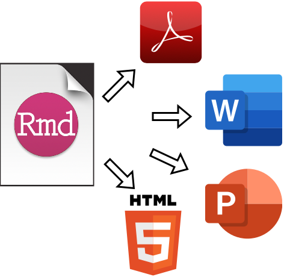

The Posit.Cloud workspace is available [here](https://posit.cloud/spaces/313764/content/all). 

# **Data Management, R Markdown & Shiny**

This training is delivered in two-parts: **Data Management & R Markdown**, and an introduction to **Shiny apps**. 

## Data Management & R Markdown

**Data Management & R Markdown** covers an introduction to data management in RStudio, common data objects in R, the basics of Markdown and `knitr`, table outputs (`tibble`, `kable` and `gtsummary`), graphics (`ggplot2`). The materials also cover importing and caching data, and rendering M Markdown files into various outputs. 

**Shiny** covers an introduction to UI layouts, reactivity (inputs, expressions, and outputs), and deployment. Additional example applications are available on the [Posit.Cloud project](https://posit.cloud/spaces/313764/content/5121916). 

### Importing Data

  - Using the IDE

  - Importing SAS files 

  - Importing multiple files 

  - Using parameters
  
### Common Data Objects

  - Atomic vectors 

  - S3 vectors 

  - Lists  

  - `data.frame`s and `tibble`s

### R Markdown Anatomy

  - Why use R Markdown?

  - Metadata (`YAML`)

  - Text (human readable)

  - Code (machine readable)

### R Markdown Tables

  - Standard static outputs (`tibble` & `kable`)  
  
  - Interactive tables (`paged`)  
  
  - Table packages (`gtsummary`)

### R Markdown Graphs

  - Introduction to `ggplot2` 
  
  - Layers (data, aesthetics, and geoms)
  
  - Global vs. local mapping
  
  - Setting vs. mapping aesthetics 
  
  - Facets 
  
## **Shiny Apps**

### Shiny app anatomy

  - ui
  
  - server
  
  - run

### User Interface (UI)

  - Layout 
  
  - Reactivity
  
  - UI inputs & outputs

### Server

  - Accessing inputs & outputs
  
  - `render*_()` functions
  
  - Reactive expressions

<!--
R Markdown is an authoring format that enables easy creation of dynamic documents, presentations, and reports from R. It combines the core syntax of [markdown](https://daringfireball.net/projects/markdown/) (an easy to write plain text format) with embedded R code chunks that are run so their output can be included in the final document. 

R Markdown documents are fully reproducible (they can be automatically regenerated whenever underlying R code or data changes).

R Markdown has many available output formats including [HTML](http://rmarkdown.rstudio.com/html_document_format.html), [PDF](http://rmarkdown.rstudio.com/pdf_document_format.html), [MS Word](http://rmarkdown.rstudio.com/word_document_format.html), [Beamer](http://rmarkdown.rstudio.com/beamer_presentation_format.html), [HTML5 slides](http://rmarkdown.rstudio.com/ioslides_presentation_format.html), [Tufte handouts](http://rmarkdown.rstudio.com/tufte_handout_format.html), [books](https://bookdown.org), [dashboards](http://rmarkdown.rstudio.com/flexdashboard/), and [websites](http://rmarkdown.rstudio.com/rmarkdown_websites.html).

-->

