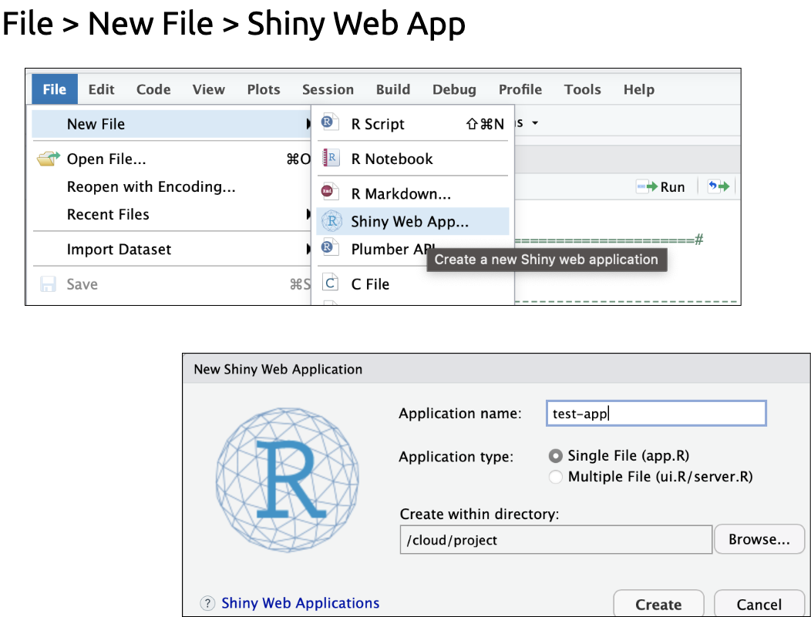
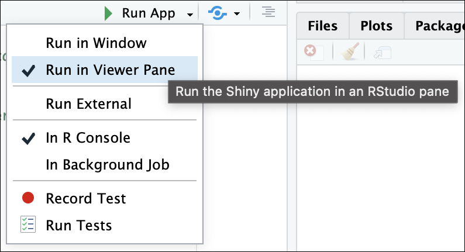
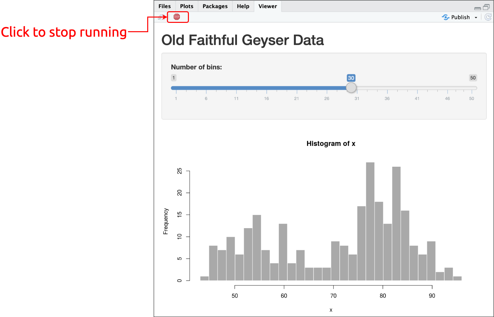

```{r setup, include=FALSE}
library(xaringan)
library(tidyverse)
library(shiny)
options(htmltools.dir.version = FALSE)
knitr::opts_chunk$set(
  dev = "ragg_png",
  dpi = 320,
  fig.width = 6,
  fig.asp = 0.618,
  fig.retina = 2,
  fig.align = "center",
  echo = TRUE,
  message = FALSE,
  warning = FALSE,
  hiline = TRUE
)
```

```{r meta, include=FALSE}
library(metathis)
meta() %>%
  meta_general(
    description = "Intro to shiny",
    generator = "xaringan and remark.js"
  ) %>%
  meta_name("github-repo" = "mjfrigaard/ph-lacounty-r/") %>%
  meta_social(
    title = "Intro to shiny",
    url = "https://mjfrigaard.github.io/ph-lacounty-r/",
    og_type = "website",
    og_author = "Martin Frigaard",
    twitter_card_type = "summary",
    twitter_creator = "@mjfrigaard"
  )
dateWritten <- format(as.Date('2022-10-03'), format = "%B %d %Y")
today <- format(Sys.Date(), format = "%B %d %Y")
paste0(dateWritten, "/", today)
```

```{r xaringanExtra, include=FALSE, warning=FALSE}
xaringanExtra::use_panelset()
```


class: title-slide, center, middle, inverse

# `r rmarkdown::metadata$title`

## `r rmarkdown::metadata$subtitle`

### `r rmarkdown::metadata$author`

#### Written/Updated: `r paste0(dateWritten, "/", today)`


---
class: left, top
background-image: url(www/pdg-hex.png)
background-position: 96% 8%
background-size: 8%

# Load the packages

Install package: `shiny`, `tidyverse`, `flexdashboard`, and `NHANES`

```{r pkgs, eval=FALSE}
pkgs <- c("shiny", "tidyverse", "flexdashboard", "NHANES")
install.packages(pkgs)
```


<br><br>

Load the packages:

```{r packages, eval=FALSE}
library(shiny)
library(tidyverse)
library(flexdashboard)
library(NHANES)
```

---
class: left, top
background-image: url(www/pdg-hex.png)
background-position: 96% 8%
background-size: 8%

# Materials

.font200[Website: https://mjfrigaard.github.io/ph-lacounty-r/] 

--

<br>

.font200[RStudio Project: https://posit.cloud/spaces/313764/] 


---
class: left, top
background-image: url(www/pdg-hex.png)
background-position: 96% 8%
background-size: 8%

## Outline

.cols3[

### Shiny app anatomy

- .font120[ui]

- .font120[server]  

- .font120[run]

]

.cols3[

### User Interface (UI)

- .font120[Layout]  

- .font120[Reactivity]

- .font120[UI inputs & outputs]

]

.cols3[

### Server

- .font120[Accessing inputs & outputs]

- .font120[`render*_()` functions] 

- .font120[Reactive expressions]

]


---
class: left, top
background-image: url(www/pdg-hex.png)
background-position: 96% 8%
background-size: 8%

# Creating a new app

```{r new-app, echo=FALSE, out.width="60%", out.height="60%"}

```

---
class: left, top
background-image: url(www/pdg-hex.png)
background-position: 96% 8%
background-size: 8%

# Run app

<br><br><br>

.leftcol[

```{r view-in-viewer, echo=FALSE, out.width="100%", out.height="100%"}

```

]

.rightcol[

```{r run-app, echo=FALSE, out.width="100%", out.height="100%"}
knitr::include_graphics("www/run-app.png")
```

]

---
class: left, top
background-image: url(www/pdg-hex.png)
background-position: 96% 8%
background-size: 8%

# Stop running app


```{r click-to-stop, echo=FALSE, out.width="65%", out.height="65%"}

```

---
class: inverse, center, top
background-image: url(www/shiny.png)
background-position: 50% 65%
background-size: 30%

# Anatomy of a shiny app

---
class: left, top
background-image: url(www/pdg-hex.png)
background-position: 96% 8%
background-size: 8%

## Shiny App Anatomy

### User interface (UI)

```{r add-ui, eval=FALSE}
ui <- fluidPage()
```

--

### Server

```{r add-server, eval=FALSE}
ui <- fluidPage()
server <- function(input, output) {}
```

--

### Run

```{r add-shinyApp, eval=FALSE}
ui <- fluidPage()
server <- function(input, output) {}
shinyApp(ui = ui, server = server)
```

---
class: inverse, center, top
background-image: url(www/shiny.png)
background-position: 50% 65%
background-size: 30%

# Shiny UI: layouts

---
class: left, top
background-image: url(www/pdg-hex.png)
background-position: 96% 8%
background-size: 8%

## Shiny UI layout

<br>

.font160[The UI contains the layout for the application, ]. 

--

<br>

*.font160[(i.e., the 'user experience' (UX) for the Shiny app)]*

--

<br>

.font160[The `shiny` package comes with a [**`fluidPage()`** layout](https://shiny.rstudio.com/reference/shiny/0.14/fluidpage)]

---
class: left, top
background-image: url(www/pdg-hex.png)
background-position: 96% 8%
background-size: 8%

# UI layout: .red[fluidPage()]

.leftcol45[

`fluidPage()` creates a [bootstrap](https://getbootstrap.com/) webpage, which combines HTML & CSS:

.code80[

```{r , eval=FALSE}
fp <- fluidPage()
fp
```

```html
<div class="container-fluid"></div>
```

]

The container (i.e., `"container-fluid"`) is between two HTML `<div>` tags, and spans [*the entire width of the viewport*](https://getbootstrap.com/docs/5.0/layout/containers/#fluid-containers).

]

--

.rightcol55[

```{r fluidpage-01.png, echo=FALSE, out.height='100%', out.width='100%'}
knitr::include_graphics(path = "www/fluidpage-01.png")
```


]

---
class: left, top
background-image: url(www/pdg-hex.png)
background-position: 96% 8%
background-size: 8%

# UI layout: .red[headerPanel()]

.leftcol45[

The `headerPanel()` is where we'll place the `title` of our app. The shiny functions convert the R code to HTML.

.code70[

```{r fp_hp, eval=FALSE}
fp_hp <- fluidPage(
            headerPanel(title = "title"))
fp_hp
```

```html
<div class="container-fluid">
  <div class="col-sm-12">
    <h1>title</h1>
  </div>
</div>
```

]

We can see `title` gets is a level 1 header (`h1`). Notice the `col-sm-12` in the HTML? That's the total width value for the container. 

]

--

.rightcol55[

```{r fluidpage-headerPanel.png, echo=FALSE, out.height='100%', out.width='100%'}
knitr::include_graphics(path = "www/fluidpage-headerPanel.png")
```


]
 
---
class: left, top
background-image: url(www/pdg-hex.png)
background-position: 96% 8%
background-size: 8%

# UI layout: .red[sidebarLayout()]


.leftcol45[

Most applications place the user-inputs widgets in a sidebar

The `sidebarLayout()` function creates a `"row"` with two panels: `sidebarPanel()` and `mainPanel()`

.code80[

```html
<div class="container-fluid">
  <div class="col-sm-12">
    <h1>title</h1>
  </div>
  <div class="row">
  <!-- sidebarLayout() panels -->
  </div>
</div>
```

]

]

--

.rightcol55[

```{r fluidpage-sidebarLayout, echo=FALSE, out.height='100%', out.width='100%'}
knitr::include_graphics(path = "www/fluidpage-sidebarLayout.png")
```

]


---
class: left, top
background-image: url(www/pdg-hex.png)
background-position: 96% 8%
background-size: 8%

# UI layout: .red[sidebarPanel()]

.leftcol40[

The `sidebarPanel()` has a width of 4 (`col-sm-4`)

.code70[

```html
<div class="col-sm-4">
  <form class="well" role="complementary">
    <!-- ... -->
  </form>
</div>
```

]

]

--

.rightcol60[

```{r fluidpage-sidebarPanel.png, echo=FALSE, out.height='100%', out.width='100%'}
knitr::include_graphics(path = "www/fluidpage-sidebarPanel.png")
```

]

---
class: left, top
background-image: url(www/pdg-hex.png)
background-position: 96% 8%
background-size: 8%

# UI layout: .red[mainPanel()]

.leftcol40[

The `mainPanel()` has a width of 8 (`col-sm-8`)

.code70[

```html
<div class="col-sm-8" role="main">
    <!-- ... -->
</div>
```

]


]

--


.rightcol60[

```{r fluidpage-mainPanel.png, echo=FALSE, out.height='100%', out.width='100%'}
knitr::include_graphics(path = "www/fluidpage-mainPanel.png")
```

]

---
class: left, top
background-image: url(www/pdg-hex.png)
background-position: 96% 8%
background-size: 8%

# UI layout: .red[fluidPage()] widths

.leftcol40[

The width of each section in `sidebarLayout()` is determined by the `width` arguments

```{r , eval=FALSE}
sidebarPanel(width =  4)
mainPanel(width =  8)
```


]

--

.rightcol60[

```{r fluidpage-complete.png, echo=FALSE, out.height='100%', out.width='100%'}
knitr::include_graphics(path = "www/fluidpage-complete.png")
```

]

---
class: left, top
background-image: url(www/pdg-hex.png)
background-position: 96% 8%
background-size: 8%

# UI layout: .red[My App]

Create a `ui` with the following `fluidPage()` layout (add an empty `server` function and build the app with)

.leftcol55[

.code70[
```r
ui <- fluidPage(
        headerPanel(title = "My App"),
            sidebarLayout(
                sidebarPanel("sidebar"),
            mainPanel("main")))
server <- function(input, output) {
}
shinyApp(ui, server)
```
]

Resulting `ui` HTML:

.code70[
```html
<div class="container-fluid">
  <div class="col-sm-12">
    <h1>My App</h1>
  </div>
  <div class="row">
    <div class="col-sm-4">
      <form class="well" role="complementary">sidebar</form>
    </div>
    <div class="col-sm-8" role="main">main</div>
  </div>
</div>
```
]

]

--

.rightcol45[

Rendered application:

```{r myapp-basic, echo=FALSE, out.height='100%', out.width='100%'}
knitr::include_graphics(path = "www/myapp-basic.png")
```

]

---
class: left, top
background-image: url(www/pdg-hex.png)
background-position: 96% 8%
background-size: 8%

# UI layout: .red[My App]

.leftcol45[

We've highlighted the code that creates each section (`<div </div>`) of the application

.code70[
```{r , eval=FALSE}
ui <- fluidPage(
    
        headerPanel(title = "My App"), #<<
    
            sidebarLayout(
                
                sidebarPanel("sidebar"), #<<
                
            mainPanel("main"))) #<<

server <- function(input, output) {
}
shinyApp(ui, server)
```
]

]

--

.rightcol55[

The corresponding sections of the app are outlined below:

```{r myapp-basic-highlight, echo=FALSE, out.height='100%', out.width='100%'}
knitr::include_graphics(path = "www/myapp-basic-highlight.png")
```

]

---
class: inverse, center, top
background-image: url(www/shiny.png)
background-position: 50% 65%
background-size: 30%

# Shiny reactivity

---
class: left, top
background-image: url(www/pdg-hex.png)
background-position: 96% 8%
background-size: 8%

## Reactivity: inputs, expressions, and outputs

.font140[Reactivity is how our R code get's converted into interactive web applications. The basic idea is this:]

--

.cols3[

We start with a .darkgreen[.font140[**reactive input**]]

```{r reactive-input, echo=FALSE, out.height='82%', out.width='82%'}
knitr::include_graphics(path = "www/reactive-input.png")
```

a value that is usually entered (or updated) in the browser by a user 


]

--

.cols3[

Inside the app, a .gray[.font140[**reactive expression**]] 

```{r , echo=FALSE, out.height='100%', out.width='100%'}
knitr::include_graphics(path = "www/reactive-expression.png")
```


is hidden from the user--it performs operations behind the scenes (calculations, type conversions, joins, etc.).

]

--

.cols3[

Back in the browser, a .red[.font140[**reactive output**]] 

```{r , echo=FALSE, out.height='82%', out.width='82%'}
knitr::include_graphics(path = "www/reactive-output.png")
```

renders the values as a graph, table, text, etc.  

]


---
class: left, top
background-image: url(www/pdg-hex.png)
background-position: 96% 8%
background-size: 8%

## Reactivity: dependencies


.font120[.red[**reactive outputs**] can] .font170[depend on multiple .darkgreen[**reactive inputs**]]

--

<br>

```{r , echo=FALSE, out.height='90%', out.width='90%'}
knitr::include_graphics(path = "www/many-reactives-01.png")
```


---
class: left, top
background-image: url(www/pdg-hex.png)
background-position: 96% 8%
background-size: 8%

## Reactivity: dependencies

.font120[.gray[**reactive expressions**] can be] .font170[*both*] .font120[dependent on] .font170[child .gray[**reactive expressions**]] 

--

.font170[*and*] .font120[.gray[**reactive expressions**] can have] .font150[.gray[**reactive expressions**] as dependent parents]

--

<br>

```{r , echo=FALSE, out.height='70%', out.width='70%'}
knitr::include_graphics(path = "www/many-reactives-02.png")
```


---
class: left, top
background-image: url(www/pdg-hex.png)
background-position: 96% 8%
background-size: 8%

## Reactivity: producers & consumers

.font120[A useful way to think about the interconnectedness between inputs, expressions, and outputs is outlined in [Mastering Shiny](https://mastering-shiny.org/basic-reactivity.html#reactive-expressions-1) and displayed in the figure below:]

<br>

--

.leftcol60[

```{r , echo=FALSE, out.height='100%', out.width='100%'}
knitr::include_graphics(path = "www/producers-consumers.png")
```

]

--

.rightcol40[

> .font110[*"I’ll use **producers** to refer to reactive inputs and expressions, and **consumers** to refer to reactive expressions and outputs."*]

]


---
class: inverse, center, top
background-image: url(www/shiny.png)
background-position: 50% 65%
background-size: 30%

# Shiny UI: inputs


---
class: left, top
background-image: url(www/pdg-hex.png)
background-position: 96% 8%
background-size: 8%

# UI inputs: .red[*_Input()] functions

.font140[Shiny has a collection of `*_Input()` functions for handling inputs in the UI:]

--

<br>

.code90[

```{r , echo=FALSE, eval=FALSE}
shiny_funs <- lsf.str("package:shiny")
base::noquote(shiny_funs[str_detect(shiny_funs, "Input$")])
```

```{r, comment="##"}
##  [1] checkboxGroupInput       checkboxInput            dateInput               
##  [4] dateRangeInput           fileInput                numericInput            
##  [7] passwordInput            restoreInput             selectInput             
## [10] selectizeInput           sliderInput              snapshotPreprocessInput 
## [13] textAreaInput            textInput                updateCheckboxGroupInput
## [16] updateCheckboxInput      updateDateInput          updateDateRangeInput    
## [19] updateNumericInput       updateSelectInput        updateSelectizeInput    
## [22] updateSliderInput        updateTextAreaInput      updateTextInput         
## [25] updateVarSelectInput     updateVarSelectizeInput  varSelectInput          
## [28] varSelectizeInput    
```

]

--

<br>

.font140[The first argument in shiny `*Input()` functions is the] .font190[`inputId`]

---
class: left, top
background-image: url(www/pdg-hex.png)
background-position: 96% 8%
background-size: 8%

# UI inputs: .red[inputId]  

.font140[Shiny apps use both input and output IDs. The `*Input()` functions create *at least one* input ID (as] .font190[`inputId`].font140[)]

--

.leftcol[

Create a `sliderInput()` in the `sidebarPanel()` of the application

.code70[
```{r , eval=FALSE}
ui <- fluidPage(
        headerPanel(title = "My App"),
            sidebarLayout(
                sidebarPanel(
                    sliderInput(
                        inputId = "mean", #<<
                        label = "Mean",
                        min = 1,
                        max = 10,
                        value = 2,
                        step = 0.5)
                    ),
            mainPanel()))
server <- function(input, output) {
    
}
shinyApp(ui, server)
```
]
]

--

.rightcol[

Click on the **.green[Run App]** icon in the upper-right corner of the app.R file

.border[
```{r , echo=FALSE, out.height='90%', out.width='90%'}
knitr::include_graphics(path = "www/runapp-icon.png")
```
]

]


---
class: left, top
background-image: url(www/pdg-hex.png)
background-position: 96% 8%
background-size: 8%

# UI inputs: .red[inputId] 

.font140[We can see our `sliderInput()` in the `sidebarPanel()` of our application]


.leftcol[

```{r , echo=FALSE, out.height='90%', out.width='90%'}
knitr::include_graphics(path = "www/sliderInput-rendered.png")
```

]


--

.rightcol[

The arguments in the `sliderInput()` are displayed below:

```{r , echo=FALSE, out.height='100%', out.width='100%'}
knitr::include_graphics(path = "www/sliderInput.png")
```

]


---
class: inverse, center, top
background-image: url(www/shiny.png)
background-position: 50% 65%
background-size: 30%

# Shiny UI: outputs


---
class: left, top
background-image: url(www/pdg-hex.png)
background-position: 96% 8%
background-size: 8%

# UI outputs: .red[*_Output()] functions

<br>

.font140[Shiny also a collection of `*_Output()` functions for handling outputs in the UI:]

--

<br>

```{r , echo=FALSE, eval=FALSE}
shiny_funs <- lsf.str("package:shiny")
base::noquote(shiny_funs[str_detect(shiny_funs, "Output$")])
```

```{r, comment="##"}
## [1] dataTableOutput          htmlOutput               imageOutput             
## [4] plotOutput               snapshotPreprocessOutput tableOutput             
## [7] textOutput               uiOutput                 verbatimTextOutput  
```

--

<br>

.font140[The first argument in these functions is the] .font190[`outputId`]


---
class: left, top
background-image: url(www/pdg-hex.png)
background-position: 96% 8%
background-size: 8%

# UI outputs: .red[outputId]  

<br>

.font140[The `*_Output()` functions are the objects we want *.green[rendered]* in the browser]

--

<br>

.font140[Graphs (`plotOutput()`), tables (`tableOutput()`), text (`textOutput()`), etc.]

--

<br>

.font140[**Important:** IDs must be unique! Don't re-use `inputId`s and `outputId`s ]

---
class: left, top
background-image: url(www/pdg-hex.png)
background-position: 96% 8%
background-size: 8%

# UI outputs: .red[outputId]  

.font140[In our app below, we'll add the `tableOutput()` function in the `mainPanel()` (which is where we want the table ***.graydark[rendered]*** in the UI)]

--

.leftcol[
.code70[

```{r , eval=FALSE}
ui <- fluidPage(
    headerPanel(title = "My App"),
    sidebarLayout(sidebarPanel(
        sliderInput(
            inputId = "mean", #<<
            label = "Mean",
            min = 1,
            max = 10,
            value = 2,
            step = 0.5)),
        mainPanel(
            tableOutput(outputId = "tbl")) #<<
        )
    )
server <- function(input, output) {
    
}
shinyApp(ui, server)
```

]
]

--

.rightcol[

Now we have an application with an `inputId` and an `outputId`

Click on .green[Run App] icon on the top of the `app.R` file

.border[
```{r , echo=FALSE, out.height='90%', out.width='90%'}
knitr::include_graphics(path = "www/runapp-icon.png")
```
]


]

---
class: left, top
background-image: url(www/pdg-hex.png)
background-position: 96% 8%
background-size: 8%

# UI outputs: .red[outputId]  

> .center[.fancy[.font180[Nothing changed in `My App`!?!?]]]

--

.leftcol[

```{r , echo=FALSE, out.height='100%', out.width='100%'}
knitr::include_graphics(path = "www/basic-app-diagram.png")
```

]

--

.rightcol[

.font120[We've only built the UI--we need to link these variables in the .font160[`server`]]


]


---
class: inverse, center, top
background-image: url(www/shiny.png)
background-position: 50% 65%
background-size: 30%

## Shiny server

---
class: left, top
background-image: url(www/pdg-hex.png)
background-position: 96% 8%
background-size: 8%

# server: .red[input$]  

.leftcol[

Any .font120[.red[**`inputId`**]] we create in the .purple[ui] is available to us in the .purple[server] as .font120[.red[**`input$[inputId]`**]]

<br>

> Typically, the `server` will contain most of the code in our app, because it holds the functions for data wrangling, analyses, and outputs

]

--

.rightcol[

Add data to `My App` by creating a `tibble` with the numbers created from the `sliderInput()`

<br>

.code70[

```{r , eval=FALSE}
server <- function(input, output) {
    
  tibble(mean_input = rnorm( #<<
                  n = 10, #<<
               mean = input$mean))  #<<
    
}
```

]

*.center[.font90[`inputId = "mean"` becomes `input$mean`]]*

]


---
class: left, top
background-image: url(www/pdg-hex.png)
background-position: 96% 8%
background-size: 8%

# server: .red[output$]  

.leftcol[

Any .font120[**`outputId`**] we create in the .purple[ui] can be accessed in the .purple[server] using .font120[**`output$[outputId]`**] 

<br>

> Outputs are created for the display in the application using Shiny's `render_*()` functions.


]


--

.rightcol[

Add the output for the `tibble` in the UI with the following code: 

.code70[
```{r , eval=FALSE}
server <- function(input, output) {

 output$tbl #<<
  
    tibble(mean_input = rnorm( 
                  n   = 10, 
                 mean = input$mean))  
      
}
```
]

.center[.font90[`outputId = "tbl"` becomes `output$tbl`)]]

]


---
class: left, top
background-image: url(www/pdg-hex.png)
background-position: 96% 8%
background-size: 8%

# server: .red[render_*()] functions 

.leftcol[

Shiny `render*()` functions are designed to work with the output functions in the UI:

<br>

```{r}
## [1] renderCachedPlot renderDataTable  
## [3] renderImage      renderPlot      
## [5] renderPrint      renderTable      
## [7] renderText       renderUI  
```

]

--

.rightcol[

Add the `renderTable()` function to the `server` (with an extra set of curly brackets!)

<br>

.code70[
```{r , eval=FALSE}
server <- function(input, output) {

  output$tbl <- renderTable({ #<<
        
    tibble(mean_input = rnorm( 
                  n   = 10, 
                 mean = input$mean)) 
        
    }) #<<
  
}
```
]

]


---
class: left, top
background-image: url(www/pdg-hex.png)
background-position: 96% 8%
background-size: 8%

## .red[shinyApp()]

.font140[Finally, to run the application, we add a call to] .font160[`shinyApp()`]

--

.leftcol[
.code70[
```{r , eval=FALSE}
ui <- fluidPage(
    headerPanel(title = "My App"),
    sidebarLayout(sidebarPanel(
        sliderInput(
            inputId = "mean",
            label = "Mean",
            min = 1,
            max = 10,
            value = 2,
            step = 0.5)),
        mainPanel(
                tableOutput(outputId = "tbl"))
        )
    )
server <- function(input, output) {
    output$tbl <- renderTable({
        tibble(mean_input = rnorm(n = 10, 
                                mean = input$mean))
    })
}
shinyApp(ui = ui, server = server) #<<
```
]
]

--

.rightcol[

```{r , echo=FALSE, out.height='100%', out.width='100%'}
knitr::include_graphics(path = "www/full-basic-app.png")
```

]

---
class: inverse, center, top
background-image: url(www/shiny.png)
background-position: 50% 65%
background-size: 30%

# Reactive expressions

---
class: left, top
background-image: url(www/pdg-hex.png)
background-position: 96% 8%
background-size: 8%

## Reactive inputs and outputs 

.font140[So far, we've learned about shiny `input`s and `output`s]

--

<br>

```{r , echo=FALSE, out.height='70%', out.width='70%'}
knitr::include_graphics(path = "www/myapp-basic-react.png")
```

--

<br>

.font140[`My App` currently renders the table in `output$tbl` by being **directly** dependent on `input$mean`]


---
class: left, top
background-image: url(www/pdg-hex.png)
background-position: 96% 8%
background-size: 8%

## Reactive expressions

.font140[We will define `tbl_data()`, a reactive expression that we can use throughout the server]

--

<br>

```{r , echo=FALSE, out.height='85%', out.width='85%'}
knitr::include_graphics(path = "www/myapp-tbl_data-react.png")
```

--

<br>


.font140[`tbl_data()` lives *outside* `renderTable()`, but updates whenever `input$mean` changes]


---
class: left, top
background-image: url(www/pdg-hex.png)
background-position: 96% 8%
background-size: 8%

## Using reactive expressions

.leftcol[

We create `tbl_data` by moving the `renderTable()` code into the `reactive()` function

.code70[

```{r , eval=FALSE}
  tbl_data <- reactive({ # note curly brackets! #<<
    tibble(mean_input = rnorm(
                         n = 10,
                      mean = input$mean))
  }) 
```

]

<br>

`round()` the `mean_input` variable to one digit

.code70[

```{r , eval=FALSE}
  tbl_data <- reactive({ 
    tibble(mean_input = rnorm(
                         n = 10,
                      mean = input$mean)) %>% 
    mutate(mean_input = round(mean_input, digits = 1)) #<<
  }) 
```

]

]

--


.rightcol[

To use reactive objects in the server, we pass `tbl_data()` directly to the `renderTable()` function

.code70[

```{r , eval=FALSE}
  output$tbl <- renderTable({
        tbl_data() # include parentheses! #<<
  })
```

]

<br><br>

Set the `digits` argument in `renderTable()` to `1` to make sure the digits render properly: 

.code70[

```{r , eval=FALSE}
  output$tbl <- renderTable({
        tbl_data()
  }, digits = 1) # after '}', before ')'! #<<

```

]


]


---
class: left, top
background-image: url(www/pdg-hex.png)
background-position: 96% 8%
background-size: 8%

## `My App`: reactive expressions

.leftcol[

The full code for the updated application:

.code65[

```{r , eval=FALSE}
ui <- fluidPage(
  headerPanel(title = "My App"),
  sidebarLayout(
    sidebarPanel(
      sliderInput(
        inputId = "mean", # input #<<
        label = "Mean",
        min = 1,
        max = 10,
        value = 2,
        step = 0.5)),
    mainPanel(
      tableOutput(outputId = "tbl")) # output #<<
  )
)
server <- function(input, output) {
  tbl_data <- reactive({
    tibble(mean_input = rnorm(
                         n = 10,
                      mean = input$mean)) %>% # input$mean #<<
      mutate(mean_input = round(mean_input, digits = 1))
  })
  output$tbl <- renderTable({ # output$tbl #<<
        tbl_data() # reactive #<<
  }, digits = 1)
  
}
shinyApp(ui = ui, server = server)
```

]

]

--

.rightcol[

The updated table with rounded digits:

```{r , echo=FALSE, out.height='100%', out.width='100%'}
knitr::include_graphics(path = "www/myapp-single-digit.png")
```

]


---
class: inverse, center, top
background-image: url(www/shiny.png)
background-position: 50% 65%
background-size: 30%

# Shiny App Workflow

---
class: left, top
background-image: url(www/pdg-hex.png)
background-position: 96% 8%
background-size: 8%

## Shiny App Workflow

--

.cols3[


**.font130[Build UI]**

.font120[

- Define Inputs

 - `inputId`s

- Define Outputs

 - `outputId`s
 
]

]

--

.cols3[

**.font130[Build Server]**

.font120[

- Access Inputs 

 - as `input$[inputId]`
 
- Build reactives

 - with `reactive({})`

- Render Outputs

 - as `output$[outputId]`
 
]

]

--

.cols3[

**.font130[Deploy]**

.font120[

- Add functions to run app 

 - `shinyApp()` or `runApp()`

]


]

---
class: left, top
background-image: url(www/pdg-hex.png)
background-position: 96% 8%
background-size: 8%

## Apps (Posit.Cloud)

.leftcol[

.font80[

**1. `basic/` shiny app**

This basic shiny app gives an overview of the `fluidPage()` layout functions, inputs, outputs, and reactives.

.code70[

```{r}
## basic
## ├── basic.R
## ├── basic.Rproj
## └── solution.R
```

]

The `basic.R` file contains an empty application, solution.R contains the worked solution from the slides (`intro-to-shiny.pdf`)

**2. `sidebar/` app**

This folder contains another version of `My App`, but without the reactive expression.

.code70[

```{r}
## sidebar
## ├── sidebar.R
## ├── sidebar.Rproj
## └── solution.R
```

]

]

]


.rightcol[

.font80[

**3. `tables/` shiny app**

The `tables` shiny app gives an overview of various table outputs in shiny (also shows how to use the `shiny::observeEvent()` function)

.code70[

```{r}
## tables
## ├── solution.R
## ├── tables.R
## └── tables.Rproj
```

]


**4. `graphs/` shiny app**

This application shows how write plotting functions for shiny apps (using `rlang` and other meta-programming methods).

.code70[

```{r}
## graphs
## ├── graphs.R
## ├── graphs.Rproj
## └── solution.R
```

]

]
]

---
class: left, top
background-image: url(www/pdg-hex.png)
background-position: 96% 8%
background-size: 8%

## More Apps (Posit.Cloud)

.leftcol[

.font80[

**5. `reactlog/` shiny app**

Open the `reactlog.R` file.

.code70[

```{r}
## reactlog/
## ├── reactives
## ├── reactlog.R
## └── reactlog.Rproj
```

]

Inside the `reactlog/` folder there are two apps: `reactives/reactive.R` and `reactives/nonreactive.R`.

.code70[

```{r}
## reactlog/reactives/
## ├── noreactive.R
## ├── reactive.R
## └── reactives.Rproj
```

]

Follow the instructions in `reactlog.R` to use the `reactlog` package.

]
]

.rightcol[

.font80[

**6. `gtrends/` shiny app**

This application creates an application using the `gtrendsR` package.

.code70[

```{r}
## gtrends/
## ├── data
## │   ├── 2022-12-15-LAGoogleDMA.csv
## │   └── 2022-12-15-LAGoogleIOT.csv
## ├── gtrends.Rproj
## └── gtrendsR.R
```

]

The application loads two datasets in `data/`

.code70[

```{r}
## gtrends/data
## ├── 2022-12-15-LAGoogleDMA.csv
## └── 2022-12-15-LAGoogleIOT.csv
```

]

These data were accessed on 2022-12-15.

**7. `navbar/` shiny app**

The navbar app contains the `navbarPage()` functions

.code70[

```{r}
## navbar/
## ├── navbar.R
## └── navbar.Rproj
```

]

]

]

---
class: left, top
background-image: url(www/pdg-hex.png)
background-position: 96% 8%
background-size: 8%

## More Resources

<br>

### [Shiny: RStudio resources](https://shiny.rstudio.com/tutorial/)

<br>

### [Mastering Shiny: A text from Hadley Wickham](https://mastering-shiny.org/)

<br>

### [Engineering Production-Grade Shiny Apps: A text from ThinkR](https://engineering-shiny.org/)